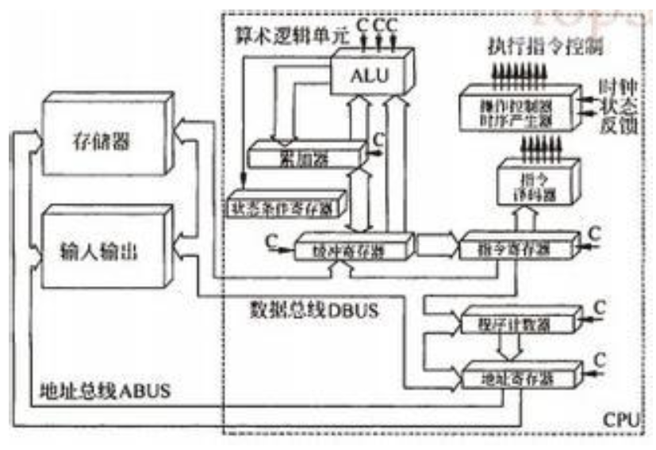
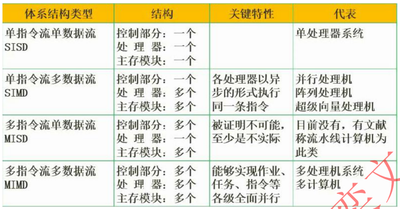
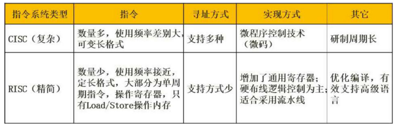

# 第1章 计算机系统知识

## 一 计算机硬件组成

#### 1. 五大组成部件
  - 运算器
  - 控制器
  - 存储器（内存、外存、cache）
  - 输入设备
  - 输出设备
  CPU = 运算器 + 控制器
  主机 = CPU + 存储器

#### 2. 中央处理器 CPU

  - 组成：运算器、控制器、寄存器组、内部总线
  - 功能：程序控制，操作控制，时间控制，数据处理功能

  - 运算器组成（执行算数和逻辑运算，并进行逻辑测试，如与或非比较等）
    - 算数逻辑单元ALU：实现对数据的算数和运算逻辑
    - 累积寄存器AC：运算结果和源操作数的存放区
    - 数据缓冲寄存器DR：暂时存放内存指令和数据
    - 状态条件寄存器PSW：保存运行结果的条件码内容
  - 控制器组成：（控制整个CPU的工作，最为重要，包括程序控制、时序控制等）
    - 指令寄存器IR：暂存CPU执行指令
    - 程序计数器PC：存放指令执行地址
    - 地址寄存器AR：保存当前CPU所访问内存地址
    - 指令译码器ID：分析指令操作码
 

#### 3. 存储器
  - 存储器结构（速度从高到低）：寄存器 -- 高速缓存Cache -- 主存 -- 外存


## 二 计算机体系结构
#### 1. 计算机体系结构分类
  - Flynn分类法
 


#### 2. 指令系统
  - 复杂指令系统 CISC ： 兼容性强，长度可变，有微程序实现
  - 精简指令系统 RISC：指令少，使用频率接近，主要依靠硬件实现
 

#### 3. 指令流水线原理
  - RISC流水线技术
    - 1)超流水线（时间换空间）
    - 2)超标量（空间换时间）
    - 3)超长指令字VLIM(执行多条指令，发挥软件作用)
 

  - 流水线时间计算：
  ```txt
  设：总指令数为 n ; 单条指令总执行时间为 t单 ; 单条指令在流水线中耗时时间最长段时间 t周
  流水线周期： 指令执行时耗时最长的那个时间段 公式为： t周
  流水线执行总时间： 单条指令总执行时间 + （指令数 - 1） * 流水线周期 公式为： t总 = t单 + （n-1）* t周
  流水线吞吐率： 总指令数 / 流水线执行总时间 公式为：( n / t总 ) = ( n / t单 + （n-1）* t周 )
  ```

#### 3. 总线结构
  - 按功能分：总线的分类：数据总线（DB），地址总线（AB），控制总线（CB）
  - 按位置分：
    - 内部总线（处理器内部通信总线）
    - 外部总线（设备一级的总线，计算机外部设通信的总线）