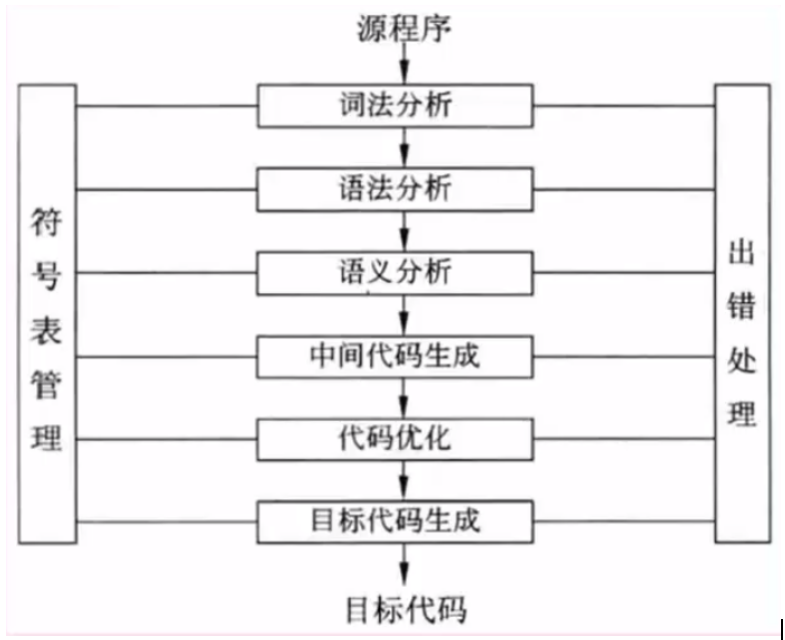
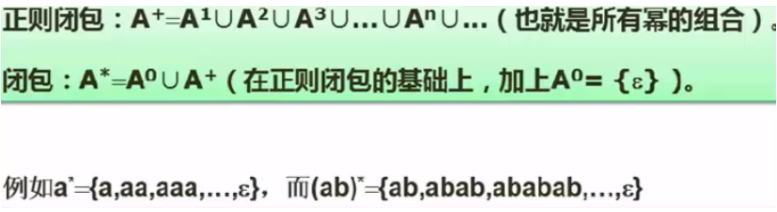
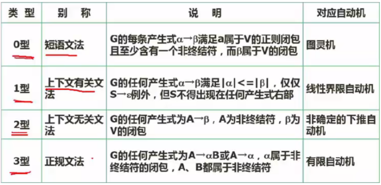
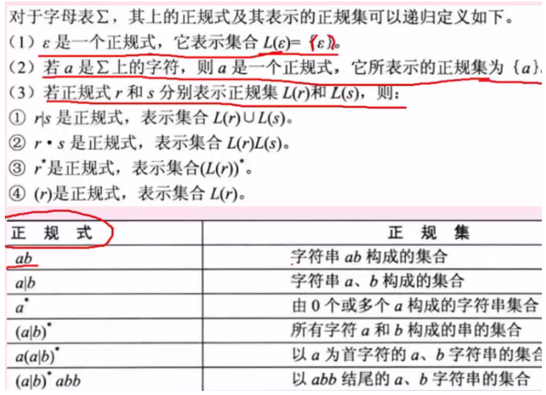
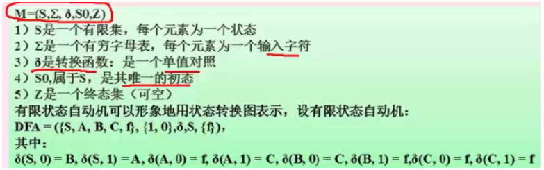

# 第2章 程序设计语言基础知识

##  一  程序设计语言概述
- 程序设计语言是为了书写计算机程序而人为设计的符号语言，用于对计算过程进行描述、组织和推导


### 1. 各语言特点
- 低级语言：机器语言（计算机硬件只能识别0和1的指令程序），汇编语言
- 高级语言：功能更强，抽象级别更高，与人们使用的自然语言比较接近

<table width="568">
    <tbody>
        <tr class="firstRow">
            <td width="568" valign="top" style="padding: 0px 7px; border-width: 1px; border-color: windowtext;">
                <p>
                    <span style=";font-family:宋体;font-size:14px">Fortran<span style="font-family:宋体">语言，科学计算，执行效率高</span></span>
                </p>
            </td>
        </tr>
        <tr>
            <td width="568" valign="top" style="padding: 0px 7px; border-left-width: 1px; border-left-color: windowtext; border-right-width: 1px; border-right-color: windowtext; border-top: none; border-bottom-width: 1px; border-bottom-color: windowtext;">
                <p>
                    <span style=";font-family:宋体;font-size:14px">Pascal<span style="font-family:宋体">语言，为教学而开发的，表达能力强，</span><span style="font-family:Calibri">delphi</span></span>
                </p>
            </td>
        </tr>
        <tr>
            <td width="568" valign="top" style="padding: 0px 7px; border-left-width: 1px; border-left-color: windowtext; border-right-width: 1px; border-right-color: windowtext; border-top: none; border-bottom-width: 1px; border-bottom-color: windowtext;">
                <p>
                    <span style=";font-family:宋体;font-size:14px">C<span style="font-family:宋体">语言，指针操作能力强，高效</span></span>
                </p>
            </td>
        </tr>
        <tr>
            <td width="568" valign="top" style="padding: 0px 7px; border-left-width: 1px; border-left-color: windowtext; border-right-width: 1px; border-right-color: windowtext; border-top: none; border-bottom-width: 1px; border-bottom-color: windowtext;">
                <p>
                    <span style=";font-family:宋体;font-size:14px">Lisp<span style="font-family:宋体">语言，函数式程序语言，符号处理，人工智能</span></span>
                </p>
            </td>
        </tr>
        <tr>
            <td width="568" valign="top" style="padding: 0px 7px; border-left-width: 1px; border-left-color: windowtext; border-right-width: 1px; border-right-color: windowtext; border-top: none; border-bottom-width: 1px; border-bottom-color: windowtext;">
                <p>
                    <span style=";font-family:宋体;font-size:14px">C++<span style="font-family:宋体">语言，面向对象，高效</span></span>
                </p>
            </td>
        </tr>
        <tr>
            <td width="568" valign="top" style="padding: 0px 7px; border-left-width: 1px; border-left-color: windowtext; border-right-width: 1px; border-right-color: windowtext; border-top: none; border-bottom-width: 1px; border-bottom-color: windowtext;">
                <p>
                    <span style=";font-family:宋体;font-size:14px">Java<span style="font-family:宋体">语言，面向对象，中间代码，跨平台</span></span>
                </p>
            </td>
        </tr>
        <tr>
            <td width="568" valign="top" style="padding: 0px 7px; border-left-width: 1px; border-left-color: windowtext; border-right-width: 1px; border-right-color: windowtext; border-top: none; border-bottom-width: 1px; border-bottom-color: windowtext;">
                <p>
                    <span style=";font-family:宋体;font-size:14px">C#<span style="font-family:宋体">语言，面向对象，中间代码，</span><span style="font-family:Calibri">.NET</span></span>
                </p>
            </td>
        </tr>
        <tr>
            <td width="568" valign="top" style="padding: 0px 7px; border-left-width: 1px; border-left-color: windowtext; border-right-width: 1px; border-right-color: windowtext; border-top: none; border-bottom-width: 1px; border-bottom-color: windowtext;">
                <p>
                    <span style=";font-family:宋体;font-size:14px">Prolog<span style="font-family:宋体">语言，逻辑推理，间接性，表达能力强，数据库和专家系统</span></span>
                </p>
            </td>
        </tr>
    </tbody>
</table>

### 2. 解释和编译
- 都是将高级语言翻译成计算机硬件认识的及其语言。
- 编译：生成独立的可执行文件，直接运行，运行时无法控制源程序，效率高。
- 解释：不生成可执行文件，可以逐条解释执行，用于调试模式，可以控制源程序，因为还需要控制程序，因此执行速度慢，相对于编译效率低。

### 3. 程序语言组成
- 语法（一组规则）
- 语义（语法成分的含义）
- 语用（构成语言的各个记号和使用者的关系）

## 二．程序设计语言的基本成分

### 1.  数据成分
是一种程序设计语言的数据和数据类型，数据分为常量（程序运行时不可改变）、变量（可以改变）、全局量（存储空间在静态数据区分配）、局部量（存储空间在堆栈区分配）

### 2.  数据类型有：
整型、字符型、双精度、单精度浮点型、布尔型等

### 3.  运算成分：
指明允许使用的运算符号即运算规则，包括算数运算、逻辑运算、关系运算、位运算等。

### 4.  控制成分：
指明语言允许标书的控制结构。包括顺序结构、选择结构、循环结构（初始化+循环体+循环条件）


### 5.  传输成分：
指明语言允许的数据传输方式。如：赋值处理、数据的输入输出等

### 6.  函数：
C程序有一个或多个函数组成，每个函数都有一个名字，其中有且仅有一个名字为main函数作为运行时的起点。函数式程序模块的主要成分，是一段具有独立功能的程序。函数使用涉及三个概念：函数定义、函数声明（先声明后使用）、函数调用

### 7 调用：
- 传值调用：将实参的值传递给形参，形参的改变不会导致调用点所传的实参的值改变。实参可是是合法的变量、常量、表达式
- 传址调用：即引用调用，将实参的地址传值给形参，即相当于实参存储单元的地址引用，因此其值改变的同时就改变了实参的值，实参不能为常-量，只能是合法的变量和表达式。
- 因此，在编程时，要改变参数值，就传址，不改变，就传值

## 三．编译程序基本原理
### 1.  功能：
是把高级语言书写的程序翻译成汇编语言或机器语言
分为6个阶段：
- 1.词法分析：对源程序字符进行扫描根据构词规则识别单词（也称单词符号或符号）
- 2.语法分析：逻辑阶段，根据识别的单词组合成各类语法短语，如：程序，语句，表达式等，分析判断源程序在结构是否正确
- 3.语义分析：逻辑阶段，对结构上正确的源程序进行上下文有关性质的审查。如：类型匹配、除法除数不为0等。分为静态语义错误（编译阶段能够发现）、动态语义错误（运行时能发现）
- 4.中间代码和目标代码生成：中间代码是语义分析产生的需要经过优化链接，最终生成可执行的目标代码。引入中间代码的目的是进行与机器无关的代码优化处理。常用的中间代码有后缀式（逆波兰式）、三元式（三地址码）、四元式和树等形式。


### 2.  文法定义：
- 2.1 形式文法四元组G=（V,T,S,P）
    1.S: 文法开始符号
    2.V: 不是语言组成部分，可理解为占位符；非终结符：能够推导出其他元素
    3.P：产生式。用终结符替代非终结符的规则；即非终结符推导出终结符的公式
    4.T: 终结符，语言组成部分，是最终结果；不能推导出其他元素

- 2.2 闭包：如下图，一般闭包可以为0个的情况代付运算


- 2.3 文法类型：

    - 1型 -》 语义分析（上下文有关）
    - 2型 -》 语法分析（上下文无关）


## 四．正规式



## 五．有限自动机



### 例：如下图：S 开始，ACB转换，F 两个圈是最终结果

```txt
S输入1，得到A输入0 得到F
S输入1，得到A输入1 ,得到C输入0,1 得到F
S输入0，得到B输入0 得到F
S输入0，得到B输入1，得到C输入0,1 得到F
每一条线路都是唯一的，得出此图为确定有限自动机
```

- 确定有限自动机：输入同一个值，得出的后继是唯一的

- 不确定的有限自动机：输入同一个值，得出多个后继,下面例子是不确定的
```txt
例：S输入1，得到B
S输入1，得到A
```

## 六．语法分析方法

### 1. 自上而下语法分析：
最左推导，从左至右。给定文法G和源程序串r,从G的开始符号出S出发，通过反复使用产生式对举行中的非终结符进行替换（推导），逐步推出r
递归下降：利用函数之间的递归调用模拟语法树自上而下的构造过程，是一种自上而下的语法分析方法

### 2. 自下而上语法分析：
最右推导，从右至左
移进-归约思想：设置一个栈，将输入符号逐个移进栈中，栈顶形成某产生式的又不时，就用左部去替换，称为归约。从右部推导出左部，是一种自下而上的语法分析方法