# 第5章软件工程基础知识

## 一.  概述
#### 1.软件工程基本原理:
用分阶段的生命周期计划严格管理/坚持进行阶段评审/实现严格的产品控制/采用现代程序设计技术/结果应能清楚的审查/开发小组的人员应少而精/承认不断改进软件工程实践的必要性.
#### 2.软件工程的基本要素
方法 工具 过程
#### 3.软件生存周期
可行性分析与项目开发计划/需求分析/概要设计(选择系统解决方案,规划子系统)/详细设计(设计子系统内部具体实现)/编码/测试/维护
#### 4.软件过程
+ 4.1能力成熟度CMM模型
对软件组织化阶段的描述，随着软件组织定义、实施、测量、控制和改进软件过程，软件组织的能力经过这些节点逐步提高。
    - 初始级 Initial：杂乱无章、混乱、无明确定义步骤，依靠个人努力和英雄式人物的作用
    - 可重复级 Repeatable：建立例基本的项目管理过程和实践来跟踪项目费用、速度和功能特性。有必要的过程准则来重复以前在同类项目的成功
    - 已定义级 Defined：过程已经文档化、标准化，依靠标准软件过程来开发和维护软件
    - 已管理级 Managed：制定了软件过程和产品质量的详细度量标准，并且被开发组织的成员所熟悉
    - 优化级 Optimized：加强了定量分析，产品反馈、新观念、新技术等是过程能够不断持续改进
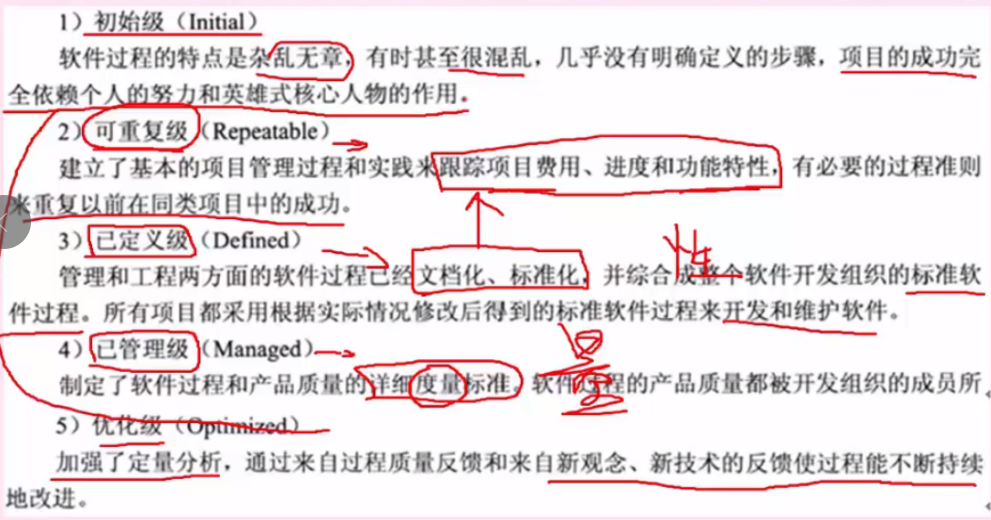

+ 4.2能力成熟度CMMI模型
    - 4.2.1 阶段型模型，关注组织的成熟度，五个成熟度模型如下
        - 初始的：过程不可预测且缺乏控制
        - 已管理的：过程为项目服务
        - 已定义的：过程为组织服务
        - 定量管理的：过程已度量和控制
        - 优化的： 集中于过程改进
    - 4.2.2 连续型模型，关注每个过程域的能力，一个组织对不同的过程域可以达到不同的过程域能力等级
        - CL0-未完成的：过程域未执行或未得到CL1中定义的所有目标
        - CL1-未执行的：过程将可表示的输入工作产品转换成可标识的输出工作产品，以实现支持过程域的特定目标
        - CL2-已管理的：以管理的过程的制度化
        - CL3-已定义的：已定义的过程的制度化
        - CL4-定量管理的：可定量管理的过程的制度化
        - CL5-优化的：使用量化手段改变和优化过程域，以满足客户要求的改变和持续改进计划中的过程域
## 二.  软件过程模型
>即软件开发模型,是软件开发全部过程、活动和任务的结构框架
#### 1. 瀑布模型 Waterfall Model
- 1.1 瀑布模型SDLC
    - 结构化方法中的模型，是结构化的开发。
    - 开发流程如同瀑布一般，一步一步的走下去，知道最后完成项目开发
    - **适用于需求明确或者二次开发（需求稳定），当需求不明确时，最终开发的项目会错误，有很大的缺陷。**

- 1.2 瀑布模型V模型
    - 时瀑布模型的一个变体
    - 特点是增加了很多轮测试，并且这些测试贯穿于开发的各个阶段，不想其他模型都是软件开发完再测试。
    - 很大程度上确保了项目的准确性


#### 2. 增量模型 Incremental Model
- 增量模型：适用于需求不明确的项目，首先开发核心模块功能，然后与用户确认，之后再开发次核心模块的功能。即每一次开发一部分功能，并与用户需求确认，最终完成项目开发，优先级最高的服务最先交付。
- 特点：不是从系统整体的角度划分整个模块，因此不利于模块划分。**难点在于如何将客户需求划分为多个增量**。与原型不同的是：增量模型的**每一次增量版本都是可独立操作的作品**，而**原型的构造一般是为了演示**。


#### 3. 演化模型 
+ 3.1 原型 Prototype Model
    - 即快速原型开发，与瀑布模型相反，原型针对的就是**需求不明确的情况**
    - 首选快速构造一个功能模型，演示给用户看，病案用户要求进行更改，中间再通过不断的演示和用户沟通，最终设计出项目，就不会出现于客户需求不符合的情况，采用的是`迭代的思想`。


+ 3.2 螺旋模型 Spiral Model
    - 是多种模型的混合，**针对需求不明确的项目**，与原型类似，但是**增加了风险分析**
    - 四步：制定计划->风险分析->实施工程->用户评估
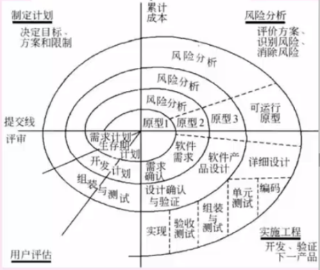

#### 4. 喷泉模型
- 是一种以用户需求为动力，以对象作为驱动的模型，适合于**面向对象的开发方法**。是开发过程具有迭代性和无间隙性。

#### 5. 基于构件的开发模型 Componment-based Development Model
- 利用预先包装的**构件**来构造应用系统。构件可以是组织内部开发的构件，也可以是商品化成产品软件的构件
- 特点是**增强了复用性**，在系统开发的过程中会**构建一个构件库**，供其他系统复用，因此可以提高可靠性，节省时间和成本

#### 6. 形式化开发模型
- 建立在**严格数学基础上的**一种软件开发方法，主要活动是生成计算机软件形式化的数学规格说明


#### 7. 统一过程模型UP
- 初始阶段： 需求和风险评估
- 精华阶段： 需求分析和架构设计
- 构建阶段： 实现过程
- 移交阶段： 测试,增量,交付

#### 8. 敏捷开发
> 针对小型项目，
主要是为了给程序员减负，
去掉了一些不必要的会议和文档。
开发宣言：个体和沟通胜过过程和工具，可以工作的软件胜过面面俱到的文档，客户胜过合同谈判，响应变化胜过遵循计划。

- 8.1 结对编程：一个程序员开发，另一个审查代码，共同负责
- 8.2 自适应开发：强调开发的适应性。
- 8.3 水晶方法：针对每一个项目需要一套不同的策略、约定和方法论
- 8.4 极限编程XP：强调简化、沟通、反馈、勇气。计划赶不上变化，无需做出很多文档，测试优先
- 8.5 并列争球法：一种迭代的增量化过程，每隔一段时间30天一次的迭代称为一个冲刺，按需求优先级，多个组织和小组并行递增实现产品
- 8.6 敏捷统一过程AUP:大型上连续，小型上迭代构建软件系统。

## 三 软件需求分析

#### 1. 需求分类
  - 1.1 按需求内容分类
    业务需求：有客户提出的宏观的一个功能需求
    用户需求：设计员去调查需求中设计到的每个用户的具体需求。
    系统需求：经过整合，形成最终的系统需求，包括功能、性能、设计约束三个方面的需求。


  - 1.2 从客户角度分类
    基本需求：需求明确规定的功能
    期望需求：除了基本需求外，客户认为利索应当包含在内的其它功能。
    兴奋需求：未要求的需求和其它功能，会兰妃项目开发时间和成本


  - 1.3 软件需求分类
    功能需求：软件必须完成的基本需求
    性能需求：软件和人与软件交互的静态或动态数值需求，如西戎响应速度、处理速度等。
    设计约束：受其他标准硬件限制等方面的影响
    属性：可用性、安全性、可维护性、可转移性
    外部结构需求：用户接口、硬件接口、软件接口、通信接口


#### 2. 需求工程
  - 2.1 需求获取：收集资料、讨论会JRP、用户访谈、书面调查、现场观摩、参加业务实践、阅读历史文档、抽样调查
  - 2.2 需求分析与协商：分析不同人提出的所有需求之间的关系并判断
  - 2.3 需求规约：即需求定义，目的是为了编写需求文档，在双方间达成一个共识
  - 2.4 需求验证：需求开发节点的复查手段，需求验证通过后，要请用户签字确认，作为验收标准之一，此时，这个需求规格说明书就是需求基线
  - 2.5 需求管理：对需求工程设计的所有过程进行规划和控制


#### 3. 需求管理
  - 3.1 定义需求基线：通过了评审的需求说明书就是需求基线，下次如果需要变更需求，就需要按照流程来一步步进行
  - 3.2 处理需求变更：主要关系需求变更过程中的需求风险管理，带有风险的做法有：无足够用户参与、忽略了用户分类、用户需求的不断增减、模棱两可的需求、不必要的特性、过于精简的srs,不准确的估算。
  - 3.3 需求跟踪：双向跟踪，两个层次，正向跟踪表示用户原始需求是否都实现了，反向跟踪表示软件实现的是否都是用户要求的，不多不少。
  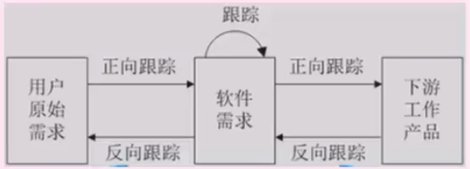

## 四 软件系统设计
- 1 系统设计阶段
    > 系统分析阶段，我们弄清楚了“做什么”的问题，并把这些需求通过规格说明书描述了出来，这也是目标系统的逻辑模型。进入设计阶段，要把软件“做什么”的逻辑模型转换成“怎么做”的物理模型

- 2 系统设计的主要目的
    >为系统制定蓝图，在各种技术和实施方法中权衡利弊，精心设计，合理地使用各种资源，得出新系统的详细设计方案

- 3 系统设计方法
    - 面向数据流的结构化设计方法
    - 面向对象的分析方法

- 4 系统设计步骤
    > 概要设计 和 详细设计
    - 概要设计基本任务：设计软件系统总体结构、数据结构和数据库设计、编写概要设计文档、评审。
    - 详细设计的基本任务：模块内详细算法设计、模块内数据结构设计、数据库的物理设计、其它设计（代码、输入/输出格式、用户界面）、详细设计说明书、评审。


## 五 软件系统测试

#### 1. 测试目的
- 系统测试时为了发现错误而执行程序的过程，成功的测试时发现了至今尚未发现的错误

#### 2. 测试原则
- 应尽早并不断的进行测试
- 测试工作应该避免有开发软件的人或小组承担
- 在设计测试方案时，不仅要确定输入数据，而且要根据系统功能确定预期的输出结果
- 即包含有效、合理的测试用例，也包含不合理、失效的用例
- 检验程序是否做了该做的事，且是否做了不该做的事
- 严格按照测试计划进行
- 妥善保存测试计划和测试用例
- 测试用例可以重复使用和追加测试

#### 3. 测试阶段
- 单元测试
    对单个模块进行测试，有程序员自己测试模块内部的接口、信息、功能，测试依据是软件详细说明说。在单元测试中，驱动模块用来调用被测试模块，自顶向下的单元测试中不需要另外编写驱动模块。桩模块（底层）用来模拟被测试模块多调用的子模块
- 集成测试
    - 将模块组合起来进行测试，分为一词性组装（简单、节约时间、发现错误少、只适合小项目）
    - 增量式组装（能够发现更多错误，耗时长，可分为：自顶向下、自底向上、混合式）

- 确认测试
    - 对已完成的软件进行功能上的测试
    - 内部确认测试：无用户情况
    - Alpha测试：用户在开发环境下进行测试
    - Beta测试：用户在实际使用时进行的测试
    - 验收测试：用户根据SRS对项目进行验收

- 系统测试
    - 对软件进行性能测试
    - 负载测试：极限情况下，系统各项性能指标
    - 强度测试：系统资源特别低的情况下
    - 容量测试：并发测试，系统可以同时处理的最大用户数量。
    - 其它还有可靠性等性能测试，系统测试采用的是黑盒测试方法

- 回归测试
    软件修改错误或变更后，进行回归测试以验证之前正确的代码是否引入了错误

#### 4. 测试方法
- 4.1 动态测试方法：程序运行时测试
    - 黑盒测试法：功能性测试，不了解软件代码结构，根据功能设计用例，测试软件功能
    - 白盒测试： 结构性测试，明确代码流程，根据代码逻辑设计用例，进行用例覆盖
    - 灰盒测试： 既有白盒也有黑盒

- 4.2 静态测试：程序静止时，对代码进行人工审查
    - 桌签审查：程序员自己检查编写的程序，在程序编译后，单元测试前
    - 代码审查：若干个程序员和测试人员组成评审小组，通过召开评审会议来进行审查
    - 代码走查：开会来进行审查，由测试人员提供测试用例，让程序员扮演计算机的角色，手动运行测试用例，检查代码逻辑

#### 5. 测试策略
- 自顶向下：先测试整个系统，需要编写桩程序，而后逐步向下直至最后测试最底层模块。有点事较早的验证例系统的主要控制和判断点
- 自底向上：从底层开始模块测试，需要编写驱动程序，而后开始逐一合并模块，最终完成整个系统的测试。优点是较早的验证了底层模块。
- 三明治：既有自底向上也有自顶向下，兼有二者的优点，但是工作量大

#### 6. 测试用例设计
- 6.1 黑盒测试
    黑盒测试用例：将程序看做一个黑盒子，只知道输入输出，不知道内部代码，由此设计出测试用例，分为下面几类：
    - 等价类划分：把所有的书按照某种特性进行归类，而后在没类的数据里选取一个即可。等价类测试用例的设计原则：1）设计一个新的测试用例，使其尽可能多的覆盖尚未被覆盖的有效等价类，重复这一步，知道所有的有效等价类都被覆盖为止。2）设计一个新的测试用例，使其仅覆盖一个尚未被覆盖的无效等价类，重复这一步，知道所有的无效等价类都被覆盖为止。
    - 边界值划分：将每类的边界值作为测试用例，边界值一般为范围的两端值以及在此范围之外的与此范围间隔最小的两个值，如年龄范围为0-150，边界值是0,150 - 1,151四个
    - 错误推测： 没有固定的方法，凭经验而言，来推测有可能产生问题的地方，作为测试用例进行测试
    - 因果图： 由一个结果来反推原因的方法，具体结果具体分析，没有固定方法。

- 6.2 白盒测试
    白盒测试用例：知道程序的逻辑代码，按照程序的代码语句来设计覆盖代码分支的测试用例，覆盖级别从第到高分为下面6种：
    - 语句覆盖：逻辑代码中的所有语句都要被执行一遍，覆盖级别最低，因为执行了所有的语句，不代表执行了所有的条件判断
    - 判定覆盖：判断语句的条件的真假都要覆盖一次
    - 条件覆盖：代码中的一个条件，可能是组合的，如 `a>0 && b<0`判断覆盖只针对此组合条件的真假分支做两个测试用例，而条件覆盖是对每个独立的条件都要做真假分支的测试用例，共可有4个测试用例。层级更高，注意区别，条件覆盖，针对每个条件都要真假覆盖，判定覆盖，只针对一个条件判断语句。
    - 判定/条件 覆盖：是判定中每个条件的所有可能取值（真/假）至少出现一次，并且每个判定本身的判定结果（真、假）也至少出现一次，即两种覆盖的综合
    - 条件组合覆盖：每个判定条件中条件的各种可能值得组合都至少出现一次
    - 路劲覆盖：逻辑代码中所有可行路径都覆盖了，覆盖层级最高

#### 7. 调试
- 测试时发现错误，调试是找出错误的代码和原因
- 调试需要确定错误的准确位置：确定问题的原因并设法改正；改正后要进行回归测试。
- 调试的方法有：蛮力法、回溯法（从出错的地方开始向回找）、原因排错法（找出所有可能的原因，逐一进行排除，具体包括演绎法、归纳法、二分法）

## 六 软件系统转换、维护、评价

#### 1. 系统转换
系统转换是指：新系统开发完毕，投入运行，取代现有系统的过程，需要考虑多方面的问题，以实现与老系统的交接，有以下三种转换计划
- 直接转换：信息同直接替换旧系统，风险大，适合于不复杂的新系统或旧系统无法使用。有点事节省成本
- 并行转换：新系统和旧系统并行工作一段时间，新系统经过测试运行后再取代，风险小。缺点是耗费人力和时间，难以控制两个系统并存间的数据转换
- 分段转换：分期分批逐步转换，是直接和并行转换的集合。将大型系统分为多个子系统，一次试运行每个子系统。适用于大型项目，耗时长，旧的系统需要和新系统混合使用，需要协调好接口等问题。

#### 2. 系统维护
- 软件维护是软件生命周期的租后一个阶段，不属于系统开发过程。是在软件已经交付使用之后为了改正错误或满足新的需求而修改软件的过程，即软件在交付后对软件所做的一切改动

- 系统可维护性可以定义为维护人员理解、改正、改动和改进这个软件的难以程度，期评价指标如下：
    - 易测试性：指为确认经修改软件所需努力有关的软件属性
    - 易分析性：指为诊断缺陷或失效原因，或为判定待修改的部分所需努力有关的软件属性
    - 易改变性：指与进行修改、排错或适应环境变换所需努力有关的软件属性
    - 稳定性：指与修改造成未预料效果的风险有关的软件属性

- 系统维护包括硬件维护、软件维护、数据维护，其中软件维护如下：
    - 正确性维护：发现了bug而进行的修改
    - 适应性维护：由于外部环境发生了改变，被动进行的对软件的修改和升级
    - 完善性维护：基于用户主动对软件提出更多需求，修改软件，正价更多的功能，性能更好，更完善
    - 预防性维护：对未来可能发生的bug进行预防性的修改

#### 3. 系统评价
- 立项评价：系统开发前的预评价，分析是否立项开发，做可行性评价
- 中期评价：项目开发过程中期每个阶段的阶段评审。或者项目在开发中途遇到重大变故，评价是否还要继续
- 结项评价：系统投入正式运行后，了解系统是否达到预期的目的和要求而对西宫进行的综合评价

- 评价指标
    - 1）从信息系统的组成部分出发：可以按照运行效果和用户需求，系统质量和技术条件这两条线索构造指标
    - 2）从信息系统的评价对象出发：对开发者来说关心的是系统质量和技术水平；对用户而言，关心的是用户需求和裕兴质量；系统外部环境则主要通过社会效益指标来反映
    - 3）从经济学角度出发，分别按系统成本，系统效益和财务指标3条线建立指标

## 七.  软件项目管理

#### 1. 软件项目估算
+ 1.1 项目估算方法
    - 成本估算方法
    - 自顶向下估算方法：又称类比估算方法，确定一个总金额，再向下分摊到每一个功能点
    - 自底向上复算：从底层功能点估算成本，向上累计
    - 差别估算：与以前项目比较，找出不同点重新估算，相同点直接估算
    - 专家估算：聘请专家一起经验对项目整体费用估算

+ 1.2 项目估算模型
    - 1.2.1 COCOMO 模型
    常见的软件规模估算方法。代码分析作为其中一种度量估计单位，已代码函数福算出每隔程序员工作量，累加得软件成本。
        - 基本COCOMO模型：用一个已估算出来的代码行树为自变量的经验函数计算软件开发工作量。
        - 中间COCOMO模型：在基本模型的基础上再用设计产品硬件、人员、项目等方面的影响因素调整工作量的估算。
        - 详细COCOMO模型：在中间模型的基础上再进一步考虑软件工程中分析、设计、过程等每一步的影响
    - 1.2.2 COCOMO II 模型
    COCOMO 模型的升级。考虑多个成本驱动因子。该方法包括三个阶段型模型。即应用组装模型（软件工程前期阶段使用），早期设计模型（需求已确定并且未建立软件体系结构时使用），体系结构模型（软件构造过程中使用）

    - 1.2.3 Putnam 估算模型
    一种动态多变量模型，假设在软件开发的整个生存周期中工作量有特定的分布。

#### 2. 软件项目进度管理
> 基本原则：划分、相互依赖、时间分配、工作量确认、确认职责、明确输出结果、确定里程碑

+ 2.1 Grantt 图
    - 甘特图，又称为横道图。横轴表示时间，纵轴表示活动，以时间顺序表示活动。
    - 能够反映活动间的并行关系，单无法反映活动之间的依赖关系。因此也能以清晰的确认关键任务和关键路径。
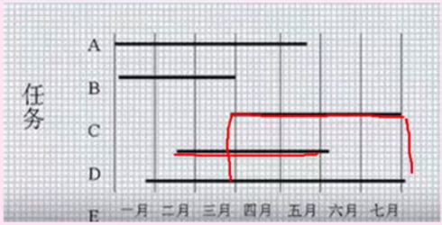
+ 2.2 Pert 图
    - 类似于前趋图，是又想吐。反映活动之间的依赖关系，有向边上标注活动的运行时间，但无法反映活动之间的并行关系。
    - 图中的节点：称为事件。`-> 节点`表示上一个节点的任务结束，`节点->`表示改节点开始任务，箭头上的事件表示从该节点开始到结束需要的时间。流入该节点所有任务都结束，该节点才开始运行。
    - 特点：不仅给出了每隔任务的开始时间、结束时间和完成所需要的时间，还给出了任务时间的关系。
    - 关键路径：项目总耗时醉成的一条线路
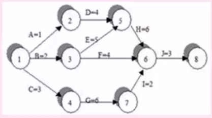


#### 3. 软件项目的组织
+ 组织结构模式：项目型（项目经理绝对领导）、职能型（部门领导为主）、矩阵型（二者都有，但是权力分割不同）

+ 程序设计小组的组织方式：
    - 主程序员小组：主程序员全权负责，后援工程师必要时能替代主程序员，适合大规模项目
    - 民主制小组：即无主程序员，决策全是成员参与投票，适合于项目规模小，开发人员少，采用新技术和确定性小的项目
    - 层次式小组：两个层次，一名组长领导若干个高级程序员；每个高级程序要领导若干个程序员。


#### 4. 软件配置管理
+ 4.1 基线：软件过程中生存期各开发阶段末尾的特定点。又称为里程碑，反映阶段性成果。

+ 4.2 软件配置项
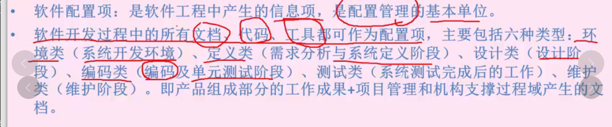

+ 4.3 版本控制
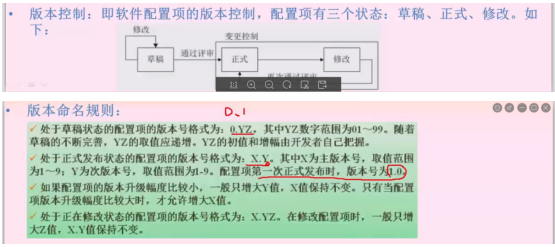

#### 5. 软件风险管理
+ 5.1 软件风险特性
    - 不确定性：可能发生也可能不发生
    - 损失：发生会产生恶性后果

+ 5.2 软件风险
    - 5.2.1。 项目风险
        > 项目风险威胁到项目计划。如果发生，有可能推迟项目的进度和增加项目的成本
        - 风险因素：项目预算、进度、人员、资源、利益相关者、需求等方面的潜在问题以及他们对软件项目的影响。
        - 项目复杂度、规模及结构不确定性也属于风险因素

    - 5.2.2 技术风险
        > 技术风险威胁到开发软件质量的交付时间。如果发生，开发工作会变的很困难或不可能
        - 风险因素：设计、实现、接口、验证、维护等方面的潜在问题
        - 此外：规格说明的歧义性、技术的不确定性、技术陈旧以及 前沿技术的风险 等因素

    - 5.2.3 商业风险
        > 威胁到开发软件的生存能力
        - 市场风险：开发了无人需要的优良系统
        - 策略风险：不在符合公司商业策略
        - 销售风险：销售部门不知道如何销售
        - 管理风险：重点转移或人员变动等带来的缺少高级管理层的支持
        - 预算风险：没有得到预算等

+ 5.3 风险管理过程
    - 风险识别：识别项目中的已知和可预测的风险，确定来源、产生条件、描述风险的特征。形成一个风险列表
    - 风险预测：预测风险发生的概率和风险发生的后果
    - 风险评估：定义风险参照水准，将识别出风险评估分类
    - 风险控制：辅助项目组建立处理风险的策略，包括风险避免，风险监控、RMMM计划（风险环节、监控和管理计划）

## 八. 软件质量

#### 1. 质量模型
-   ISO/IEC9126 质量模型
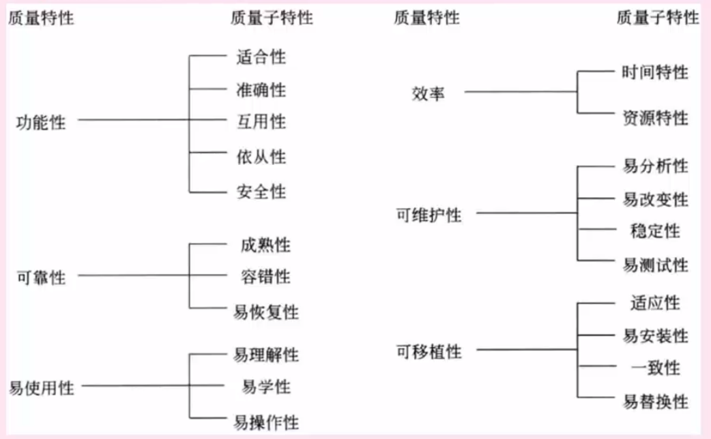
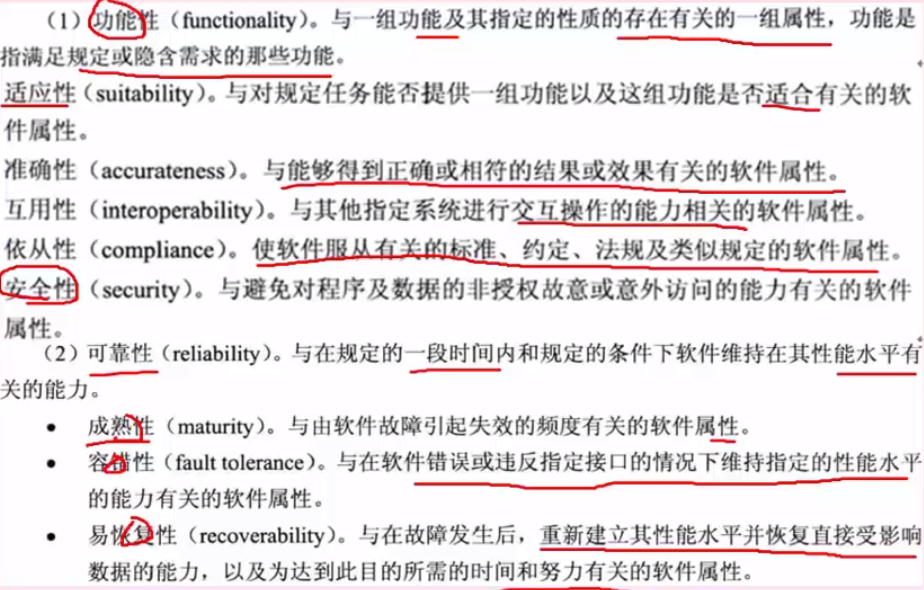


-   McCall II 质量模型
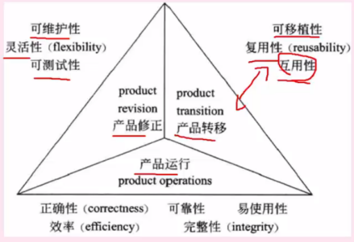

#### 2. 软件质量保证
- 3个要点：
    - 软件必须满足用户需求，与用户需求不一致的软件无质量可言。
    - 软件影尊徐规定的一些列开发标准，不遵循这些这则的软件质量无法保证
    - 软件还应满足某些隐含的需求：可理解性，可维护性等
- 7个任务：
    - 应用技术方法
    - 正式的技术评审
    - 测试软件
    - 标准的实施
    - 控制变更
    - 度量
    - 记录保存和报告

#### 3. 软件质量评审
- 设计的规格说明书符合用户标准，称为设计质量
- 程序按照设计规格说明书所规定的情况正确执行，称为程序质量

#### 4. 容错技术
> 容错就是软件遇到错误的处理能力。主要手段是冗余
- 结构冗余：静态（表决，比较，少数服从多数），动态（多重模块待机备份，故障时切换备份机），混合（两者结合）
- 信息冗余：为检错和纠错再数据中加上一段额外的信息，如校验码原理
- 时间冗余：遇到错误是重复执行，例如回滚，重复执行还有错则转入错误处理逻辑
- 冗余附加技术：为实现：结构、信息、时间的冗余技术所需的资源和技术。包括程序、指令、数据、存放和调动他们的空间和通道等。
```txt
在屏蔽硬件错误的容错技术中，冗余附加技术包括：关键程序和数据的冗余及调用；检测、表决、切换、重构和复算的实现。
在屏蔽软件错误的容错技术中，冗余附加技术包括：冗余备份程序的存储及调用；实现错误检测和错误恢复的程序；实现容错软件所需的固化程序。
```

## 九. 软件度量
- 软件的两种属性：外部属性指面向管理的属性，可直接测量，一般为性能指标。内部属性指软件产品本身的属性，如可靠性等，只能间接测量
- McCabe 度量法：又称为环路复杂度，假设有向图中有向边为m，节点数为n，则此有向图的环路复杂度为**m-n+2**
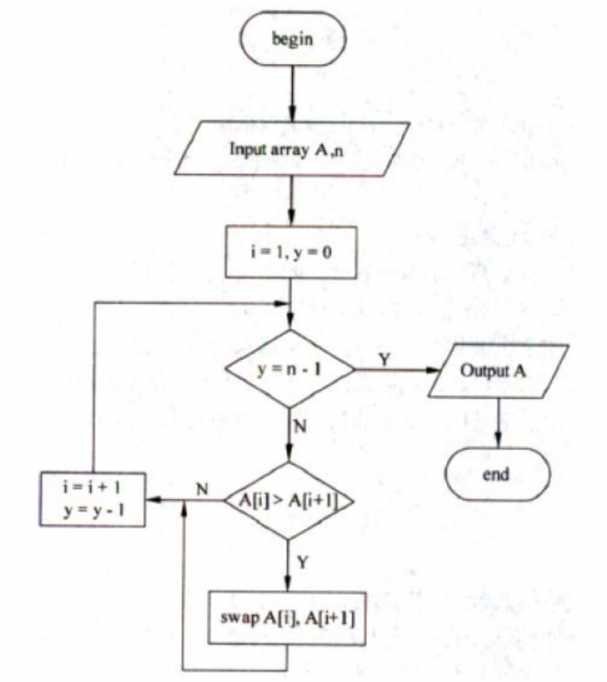
> m、n 代表的含义不能混淆。对于程序流程图：每一个条分支边就是一条有向边，每一个语句就是一个顶点

## 十.  软件工具与软件开发环境

#### 1. 开发工具
 - 1.1 软件开发工具：软件开发过程的各种活动使用的工具
    - 需求分析工具
    - 设计工具
    - 编码和排错工具
    - 测试工具

- 1.2 软件维护工具：维护过程中的活动的软件，对软件代码何其文档进行各种维护活动
    - 版本控制工具
    - 文档分析工具
    - 开发信息库工具
    - 逆向工程工具
    - 再工程工具

- 1.3 管理和软件支持工具：管理活动和支持活动，确保软件高质量的完成
    - 项目管理工具
    - 配置管理工具
    - 软件评测工具

#### 2. 开发环境
- 由工具集合环境集构成。工具集用于软甲开发的过程、活动、任务。环境集用于提供环境统一的支持。

