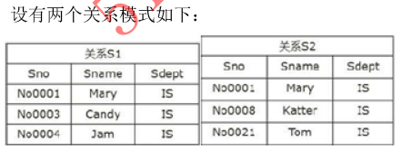
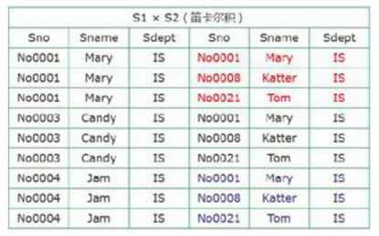
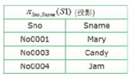
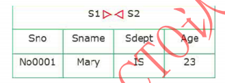
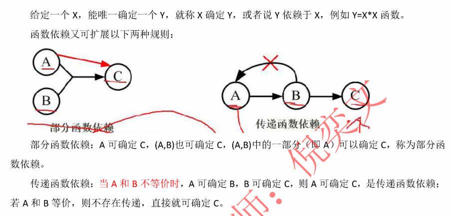
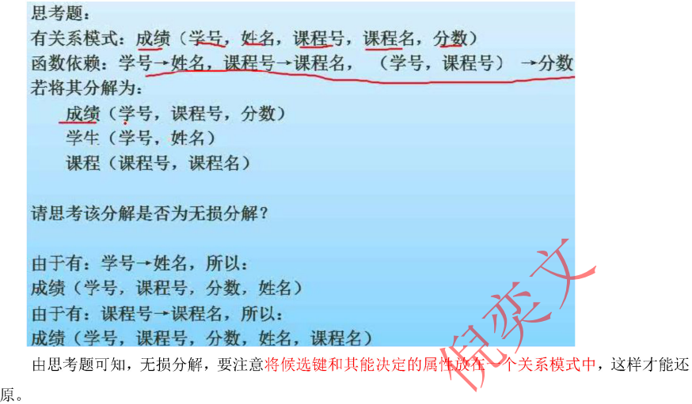
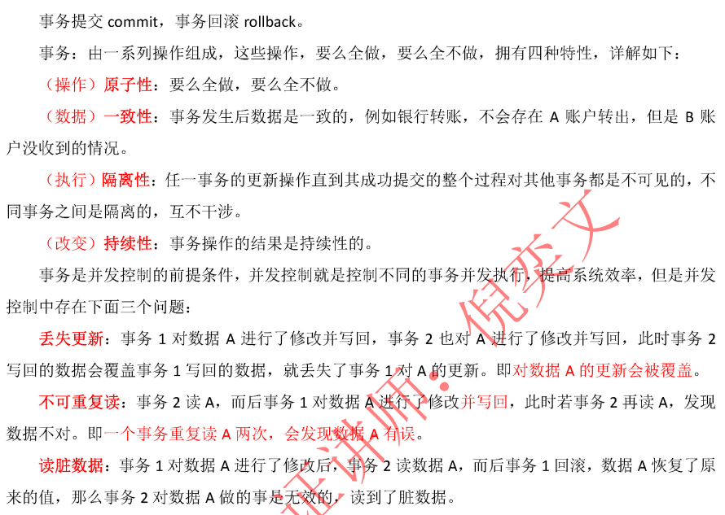
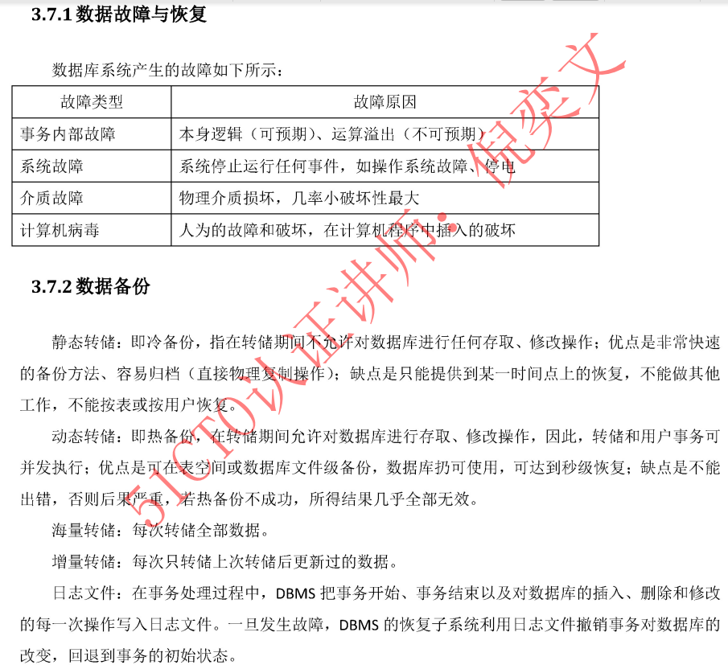

# 第9章 数据库技术基础

## 一 数据库基本概念

### 1. 数据库系统DBS
- 组成：数据库（数据集合）、硬件、软件、人员
- 分类：
  - 关系型数据库（oracle/sybase/sql server/mysql）
  - 面向对象型数据库（OODBS）
  - 对象关系型数据库（ORDBS）

### 2. 数据库系统体系结构
- 集中式数据库系统
- 客户端/服务器结构
- 并行数据库系统
- 分布式数据库系统
  - 局部数据库位于不同的物理位置，使用一个全局DBMS将所有局部数据库联网管理，就是分布式数据库

### 3. 数据库的三级模式和两级映像
- 外模式：对应数据库中的**视图**这个级别,将表进行一定的处理后再提供给用户使用。
- 模式： 称为概念模式，就是通常使用的**表**这个级别，根据应用、需求将物理数据划分成一张张表。
- 内模式：管理如何存储物理的数据，对数据的存储方式、优化、存放等。

- 外模式--模式 映像：是视图和表之间的映射，存在于概念级和外部级之间，若表中数据发生了修改，只需要修改此映射，而无需修改引用程序。
- 模式--内模式 映像：是表和数据的物理存储之间的映射，存在于概念级和内部级之间，若修改了数据存储方式，只需要修改此映射，而不需要去修改应用程序。


## 二 数据模型
> 数据模型的三要素：数据结构、数据操作、数据的约束条件
### E-R模型图

- 联系分为三种
  - 1:1 联系，联系可以放到任意的两端实体中，作为一个属性
  - 1:N 联系，联系可以单独作为一个关系模型，也可以在N端中加入1端实体的主键
  - M:N 联系，联系必须作为一个单独的关系模型，其主键是M和N端的联合主键
- 每个实体都对应一个关系模型

## 三 关系代数运算
- 数据库中代数运算概念 
  - 并：结果是两张表中所有记录数合并，相同记录只显示一次
  - 交：结果是两张表中相同的记录
  - 差：S1-S2,结果是S1表中有而S2中没有的那些记录

### 1. 笛卡尔积：
- `s1*s2，产生的结果如下图，包括s1和s2所有的属性列，并且s1中每条记录依次和s2中每条记录组合成一条记录，最终属性列为s1+s2属性列，记录数为s1*s2`


### 2. 投影：实际是按条件选择某关系模式中的某列，列也可以用数字表示


### 3. 选择：实际是按照条件选择某关系模式中的某条记录


### 4. 连接：结果与笛卡尔积类似，但是相同名称的属性列只显示一次

### 5. 自然连接：结果是显示全部的属性列，但是相同属性列只显示一次，显示两个关系模式中属性相同且值相同的记录



## 四 SQL语句
```sql
#创建表
create table;
#指定主键
primary key();
#指定外键
foreign key();
#修改表
alter table;
#删除表
drop table;
#索引index，视图view
#数据库查询
select ... from ... where;
#分组查询,select 后的列名要使用分组，条件选择使用 having
group by .... having .....
#更名运算 as
#字符皮牌
like ,%匹配多个字符 , _ 匹配一个字符
#数据库插入
insert into ... values();
#数据库删除
delete from ... where ...;
#数据库修改
update ... set ... where ...;
#排序 
order by asc | desc ;
# 授权
grant .... on ... to 
#收回权限
revoke ... on ... from;
with check option #检查where后的谓语条件
DISTINCT # 过滤重复选项，指保留一条记录
UNION #出现在连个sql语句之间，将两个结果取或运算，即存在于第一句或第二句的都会被选出
INTERSECT #出现在连个sql语句之间，对两个语句的查询结果与运算，同时存在于两个语句之间才被选出
```
## 五 关系数据库的规范化

### 1. 函数依赖


### 2. 规范化
- 用途： 解决数据冗余、更新异常、插入异常、删除异常
- 键和约束
  - 超键：能唯一标识此表的属性的组合
  - 候选键：超键中去掉冗余的属性，剩余的属性就是候选键
  - 主键：候选键任选一个可以作为主键
  - 外键：其他表中的主键
  ```txt
  候选键求法：根据依赖集画出有向图，从入度为0的节点开始，找出图中一个节点或者一个节点组合，能够遍历完整个图，就是候选键
  实体完整性约束：即主键约束，主键不能为空，也不能重复
  参照完整性约束：即外键约束，外键必须是其他表中已经存在的主键的值，或者为空
  ```

##### 2.1 第一范式：1NF 所有属性都不可以在分割为两个或多个分量

##### 2.2 第二方式：2NF 在1DF基础上，每一个非主属性完全依赖主键 **（不存在部分依赖）**

##### 2.3 第三范式：3NF 在2NF基础上,非主属性不传递依赖于候选键（主键组合），主键直接决定非主属性

##### 2.4 BCNF范式：BCNF 在2NF基础上,所有属性都不传递依赖于候选键

##### 2.5 第四范式：4NF 在3NF基础上,删除所有多对多关系

### 3. 模式分解
- 模式之间的转黄一般都是通过拆分属性，即模式分解，将具有部分函数依赖和传递依赖的属性分离出来，来达到一步步优化，一般分为两种

- 3.1 保持函数依赖分解
  - 对于关系模型R，有依赖集F,若对R进行分解，分解出阿里的多个关系模型保持原来的依赖集不变，则为保持函数依赖的分解。分解后通过产地依赖实现属性的跨表函数依赖也是可以的。

- 3.2 无损分解
  - 将关系R分解成多个关系莫时候，还能还原成原来的关系模式R,这就是无损分解

  - 无损分解定理：R 分解为{R1,R2},F为满足R所满足的函数依赖集合，分解p具有无损连接性的充分必要条件是R1∩R2->(R1-R2) R2∩R2->(R2-R1)

## 六 数据库的控制和功能

### 1. 事物管理

- X锁，排它锁：若事务T对数据对象A将X锁，则只允许T读取和修改A，其它事物都不能在对A加任何类型的锁，直到T释放A上的锁
- S锁，共享锁：若事务T对数据对象A加上S锁，则只允许T读取A，但不能修改A，其它事物只能再对A加S锁，直到T释放A上的S锁
- 解锁的时间不同，会造成预防问题的个数不同，即为不同的封锁协议。

### 2. 数据库故障和备份



### 3. 并发控制

