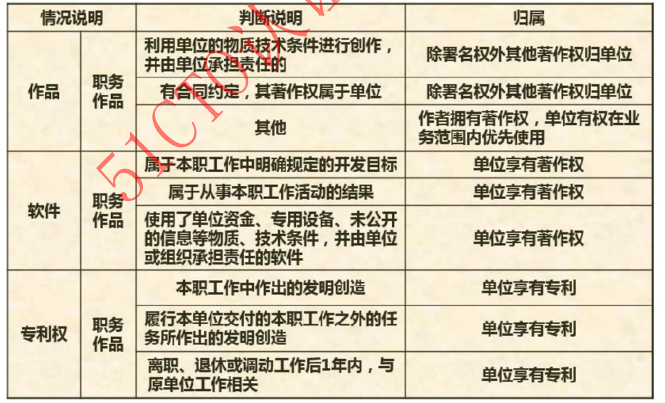
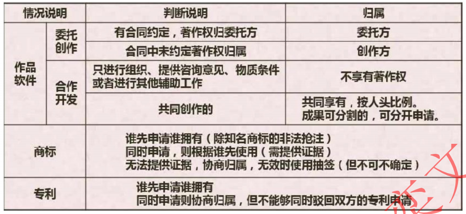
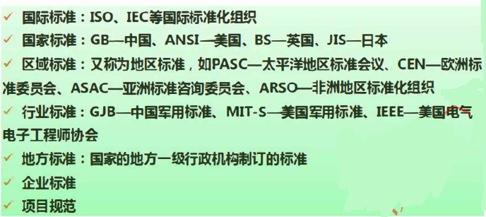

# 第11章标准化和软件知识产权基础知识

## 一.知识产权的基础知识

### 1. 知识产权的保护期限
- 当以单位为主体时，是没有署名权和修改权的，因为属于集体

### 2. 知识产权人的确定
- 著作权和专利权 在 单位和个人情况下的归属

- 单位和委托的区别在于，当合同中未确定著作权归属是，著作权默认归于单位，而委托创作中，著作权默认过属于创作方个人

### 3. 侵权判定
- 个人未发表的东西被抢先发表属于侵权

- 只要不进行传播、公开发表、盈利都不算侵权，具体如下：、

### 4. 相关法律名词解释

### 二 标准化基础知识

### 1. 标准的分类

### 2. 标准的编号

