# 第3章 数据结构

## 一.线性结构

### 1. 概念
- 每个元素最多只有一个出度和一个入度,表现为一条线装.线性表按照存储范式分为顺序表和链表.

### 2. 存储结构
- 顺序存储: 用一组地址联系度的存储单元一次存储线性表中的数据元素,使得逻辑上相邻的元素物理上也相邻
- 链式存储: 存储各数据元素的结点的地址并不要求是连续的,数据元素逻辑上相邻,物理上分开

### 3. 线性表
- 顺序存储和链式存储的对比


- 空间性能: 因为链表还要存储指针,所以有空间浪费的情况,因此密度小与顺序存储,因为可以动态改变容量分配更优化
- 时间方面: 因为指针的存在,每次查找需要耗费更多的时间,因此读取和查找顺序表更优,但是删除和插入因为顺序表每次操作完后需要依次前移或后移,因此链式更优

### 4. 单链表(线性表的一种)
- 单链表的插入和删除

```txt
上图中p所执行的节点后插入s指向的节点,操作为:(像是变量赋值)
s->next = p ->next;
p->next=s;
同理,在单链表中删除p所指向节点的后继节点q时,操作为:
p->next=p->next->next;
free(q)
```

### 5. 栈和队列
- 队列: 先进先出,分队尾和队头
- 栈: 先进后出,只有栈顶能进出
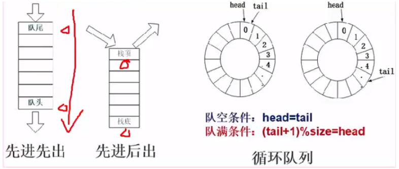

- 循环队列: 当指针指向第一个元素,尾指针指向最后一个元素的下一个位置,因此队列空时:head=tail,队列满时:head=tail,这样就无法区分了.因此队列少存一个元素,这样队列满时:tail+1=head.而考虑是循环队列,必须除以最大元素数来取余数,即(tail+1)%size=head.
- 循环队列长度公式为:(Q.tail-Q.head)%size
- 优先队列: 元素被赋予优先级.当访问元素时,具有最高优先级的元素最先删除.使用堆来存储,因为其不是按照元素进队列的顺序决定的. 

### 6. 串
字符串是一种特殊的线性表,其数据元素都为字符
子串: 长度为0的字符串,没有任何字符.
空格串: 有一个或多个空格组成的串,空格是空白字符串,占一个字符长度
子串: 串中任意长度的连续字符构成的序列成为子串.含有子串的串为主串,空串是任意串的子串
串的模式匹配算法: 子串的定位操作,用于查找子串在串中第一次出现的位置的算法.
基本的模式匹配算法: 也称为布鲁特一福斯算法,子串从头依次开始匹配,直到匹配成功就称为子串
KMP算法: 是对基本模式匹配算法的改进: 每当匹配过程中出现相比较的字符不相等时,不需要回溯主串的字符位置指针,而是利用已经得到的”部分匹配”结果将模式串向有”滑动”尽可能远的距离,再继续比较.


### 7. 数组
- 数组是定长线性表的扩展,N维数组是一个”同构”的数据结构,其每个数据元素类型相同,结构一致
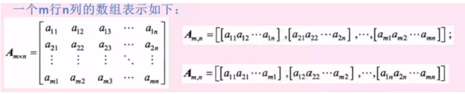
可以表示为行向量形式或者列向量形式线性表,单个关系最多只有一个前驱和一个后继,本质是线性的.
- 数组结构特点: 元素数目固定,元素类型相同,下标关系具有上下界的约束且有下标序列一般不做插入和删除运算,适用于顺序结构
- 数组存储地址计算: 假设每个元素占用存储长度len,起始地址a


### 8. 矩阵
- 特殊矩阵: 矩阵中的元素(或非0的元素)的分布有一定的规律.常见的特殊矩阵有对称矩阵,三角矩阵,对角矩阵
- 稀疏矩阵: 在一个矩阵中,若非零元素的个数远远少于零元素个数,且非零元素的分布没有规律.
- 存储方式为三元组结构,即存储每个非零元素的(行,列,值)


## 二.广义表

### 1. 概念: 
广义表是线性表的推广,是由0个或多个单元素或字表组成的有限序列.

### 2. 广义表与线性表的区别:
- 线性表的元素都是结构上不可分得单元素,而广义表的元素即可以单元素,也可以是有结构的表.
- 广义表一般记为: LS=(a1,a2,a3,.....an)
- 广义表中,LS 是表名,ai是表元素,它可以是子表,也可以是单元素.
- n是广义表的长度,n=0的广义表为空表;而递归意义的重数就是广义表的深度,即定义中包含括号的重数(单边括号的个数, 原子的深度是0, 空表的深度为1 )
- head()取表头:
可以是第一个表元素,也可以是子表也可以是单元素
- tail()取表尾: 
除了第一个表元素,其它所有表元素构成的表称为表尾.非空广义表的表尾必定是一个表,即使表尾是单元素

## 三.树

### 1. 概念:
- 树结构是一种非线性结构,树中的每一个数据元素可以有两个或两个以上的直接后继元素,用来描述层次结构关系
- 树是n个节点的有限集合(n>=0),单n=0时称为空树,在任一颗费空树中,有且仅有一个根节点;其余节点可分为m(m>0)个互不相交的有限子集T1,T2,....Tm其中每个Ti又都是一棵树,并且成为根节点的子树.
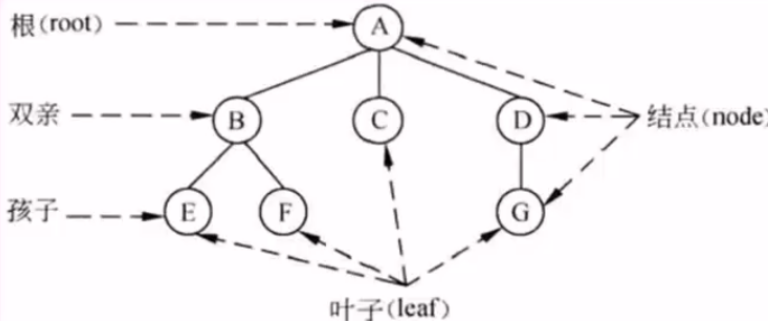


## 四.二叉树

### 1. 二叉树概念
- 二叉树是个n个节点的有限集合,它或者是空树,或者是一个节点及两颗互不相交的且分别成为左,右子树的二叉树所组成.与树的区别在于每个根节点最多只有两个孩子节点.
- 二叉树的特性:


### 2. 二叉树的存储结构
- 二叉树的存储结构
  - 用一组连续的存储单元,从上到下,从左到右依次存储每个节点
  
  - 深度为K的完全二叉树,除k层外,其余每层 中节点数都是上一层的两倍,因此,从一个节点的标号可推知其双亲,左海子,右孩子节点的编号.
  假设节点为i

- 二叉树的链式存储结构
一般用二叉树表来存储二叉树节点,二叉树表中除了节点本身的数据外,还存储有左孩子节点的指针,右孩子节点的指针,即有一个数据+两个指针.
每个二叉链表节点存储一个二叉树节点,头指针则指向根节点.


### 3. 二叉树的遍历
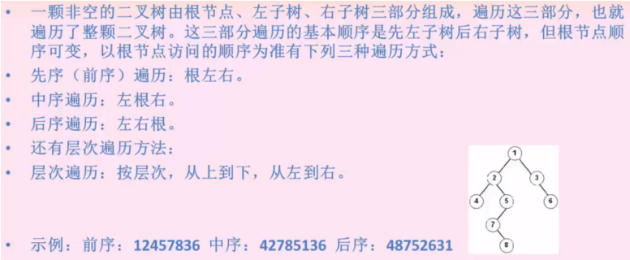

### 4. 线索二叉树
- 使用线索二叉树目的: 
获取节点的前驱后后继信息

- 使用线索二叉树原因: 
二叉树的链式存储只能获取到某节点的左孩子和右孩子节点,无法获取其遍历时的前驱和后继节点.因此可以在链式存储中增加两个指针域,使其分别指向前驱和后继节点,但是这样太浪费存储空间

- 可考虑以下实现方法:
若N个节点的二叉树使用二叉链表存储,必然有N+1个空指针域,利用这些空指针来存放节点的前驱和后继节点信息,为此,需要增加两个标志,以区分指针域存放的到底是孩子几点还是遍历节点,如下:


### 5. 最优二叉树
- 哈夫曼树: 最优二叉树
- 路径: 两个节点之间的通路
- 节点路径长度: 路径上的分支数目
- 权: 节点代表的值
- 节点带全路径长度: 节点路径长度 * 节点的值
- 数的路径长度: 根节点->每一个子节点路径长度 之和
- 输的带权路径长度(输的代价) : 所有子节点带权路径长度 之和
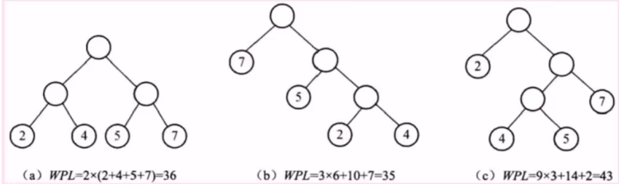
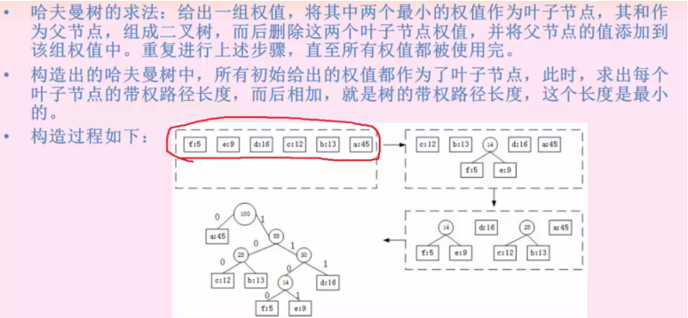


## 五.树和森林
### 1.树的存储结构
- 双亲表示法: 用一组连续的地址单元存储树的节点,并在每个节点中附带一个指示器,指出其双亲节点所在数组元素的下标.
- 孩子表示法: 在存储结构中用指针指出节点的每个孩子,为树中的每个节点的孩子建立一个链表.
- 孩子兄弟表示法: 又称为二叉链表表示法,为每个存储节点设置两个指针域,分别指向该节点的第一个孩子和下一个兄弟节点.

### 2.树和森林的遍历
由于树中的每个节点可能有多个子树,因此遍历树的方法有两种:
先根遍历: 先访问根节点,再依次遍历根的各颗子树.
后根遍历: 先遍历根的各颗子树,再访问根节点.
森林中有很多颗树,森林的遍历方法也分为两种,与树的遍历类似,就是对森林中的每颗树都依次做先根遍历或后根遍历.

### 3.树和二叉树的转换
规则是: 树的最左边节点作为二叉树的左子树,树的其他兄弟节点作为二叉树的右子树节点.
示例如下图: 采用连线法,将最左边节点和其兄弟节点都连接起来,而原来的父节点和兄弟节点的连线则断开,这种方法最简单:
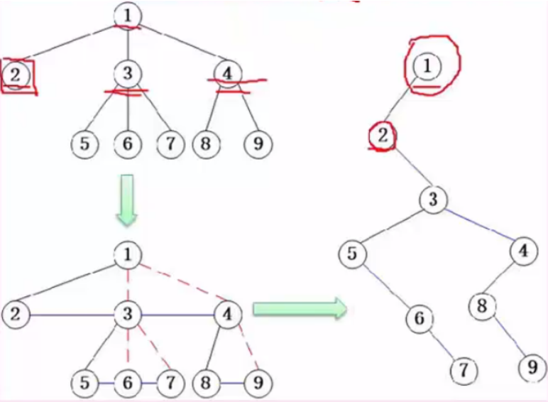

### 4.查找二叉树
查找二叉树上的每个节点都存储一个值,且每个节点的所有左孩子节点值都小于父节点值,而所有右孩子节点值都大于父节点值,是一个有规则排列的二叉树,这种数据结构可以方便查找,插入等数据操作.
二叉排序树的查找效率取决于二叉排序树的深度,对于结点个数相同的二叉排序树,平衡二叉树的深度最小,而单枝树的深度是最大的,故效率是最差的.
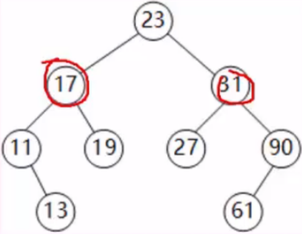

### 5.平衡二叉树
平衡二叉树: 特点是所有左子树值小于根节点值,所有右子树值大于根节点值,而这个节点可以构造出多个不同的二叉树,并不唯一,因此提出平衡二叉的概念.在查找二叉树的特点基础上,要求每个节点的平衡度只能为0或1或-1.
节点的左右子树深度就是其左右子树各自的层数,而后将左子树深度减去右子树深度,就得到了该节点的平衡度,因此,平衡二叉树就是任意左右子树层次相差不超过1

## 六.图
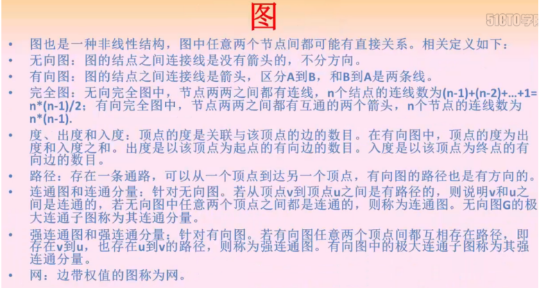

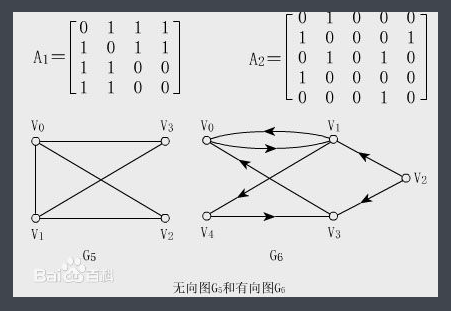

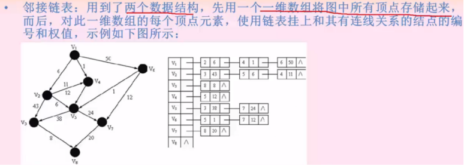

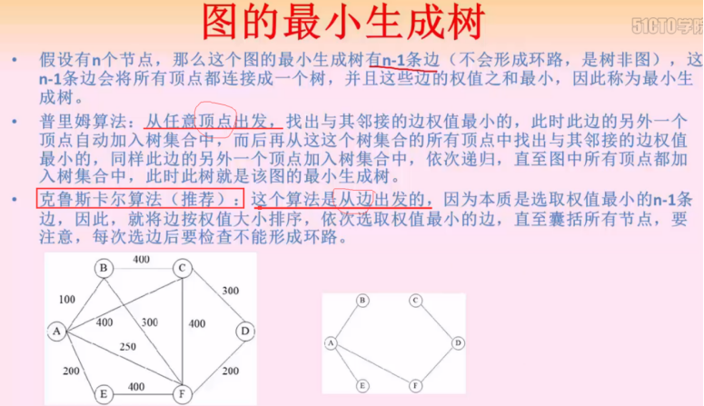
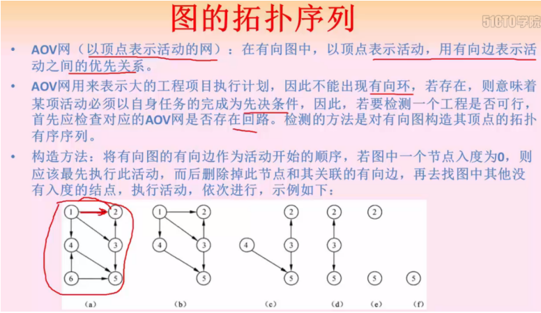
