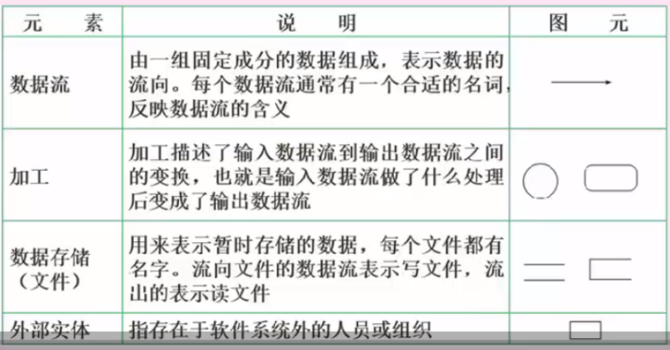

## 五 结构化分析

#### 1. 结构化分析方法
    > 结构化的分析方法SA：自顶向下，逐步分解，是面向数据的，强调分析对象的数据流；
    > 需要建立：功能模型（数据流图），行为模型（状态转换图），数据模型（E-R图），数据字典（数据元素，数据结构，数据流，数据存储，加工逻辑，外部实体）

#### 2. 数据流图
    - 2.1 数据流图描述数据在系统中如何被传送或变换，以及如何对数据流进行变换的功能或子功能，用于对功能建模，数据流图相关概念如下图：

    - 2.2 数据流图是可以分层的，从顶层（即上下文无关数据流）到0层、1层等，顶层数据流图只含有一个加工处理表示整个管理信息系统，描述了系统的输入输出，以及和外部实体的数据交互。如下：

    - 2.3 数据流图的基本设计原则
        - 1） 数据守恒原则：对任何一个加工来说，其所有输出数据流中的数据必须能从该加工的数据数据流中直接获得，或者说是通过该加工能产生的数据
        - 2） 守恒加工原则：对同一个加工来说，输入和输出的名字必须不相同，即使他们的组成成分相同。
        - 3） 对于每个加工，必须既有输入数据流，又有输出数据流
        - 4） 外部实体与外部实体之间不存在数据流
        - 5） 外部实体与数据存储之间不存在数据流
        - 6） 数据存储于数据存储之间不存在数据流
        - 7） 父图和子图的平衡原则：子图的输入输出数据流同父图相应加工的输入输出数据流必须一致，此即父图和子图的平衡。此平衡原则不存在与单张图。
        - 8） 数据流与加工相关，且必须经过加工

#### 3. 数据字典
    - 数据字典是用来定义在数据流图中出现的符号或者名称的含义，在数据流图中，每个存储、加工、实体的含义都必须定义在数据字典中。并且父图和子图之间这些名称要相同。如下

## 六 系统测试基础知识

#### 1. 测试目的
    - 系统测试时为了发现错误而执行程序的过程，成功的测试时发现了至今尚未发现的错误

#### 2. 测试原则
    - 应尽早并不断的进行测试
    - 测试工作应该避免有开发软件的人或小组承担
    - 在设计测试方案时，不仅要确定输入数据，而且要根据系统功能确定预期的输出结果
    - 即包含有效、合理的测试用例，也包含不合理、失效的用例
    - 检验程序是否做了该做的事，且是否做了不该做的事
    - 严格按照测试计划进行
    - 妥善保存测试计划和测试用例
    - 测试用例可以重复使用和追加测试

#### 3. 测试阶段
    - 单元测试
        对单个模块进行测试，有程序员自己测试模块内部的接口、信息、功能，测试依据是软件详细说明说。在单元测试中，驱动模块用来调用被测试模块，自顶向下的单元测试中不需要另外编写驱动模块。桩模块（底层）用来模拟被测试模块多调用的子模块
    - 集成测试
       - 将模块组合起来进行测试，分为一词性组装（简单、节约时间、发现错误少、只适合小项目）
       - 增量式组装（能够发现更多错误，耗时长，可分为：自顶向下、自底向上、混合式）

    - 确认测试
        - 对已完成的软件进行功能上的测试
        - 内部确认测试：无用户情况
        - Alpha测试：用户在开发环境下进行测试
        - Beta测试：用户在实际使用时进行的测试
        - 验收测试：用户根据SRS对项目进行验收

    - 系统测试
        - 对软件进行性能测试
        - 负载测试：极限情况下，系统各项性能指标
        - 强度测试：系统资源特别低的情况下
        - 容量测试：并发测试，系统可以同时处理的最大用户数量。
        - 其它还有可靠性等性能测试，系统测试采用的是黑盒测试方法

    - 回归测试
        软件修改错误或变更后，进行回归测试以验证之前正确的代码是否引入了错误

#### 4. 测试方法
    - 4.1 动态测试方法：程序运行时测试
        - 黑盒测试法：功能性测试，不了解软件代码结构，根据功能设计用例，测试软件功能
        - 白盒测试： 结构性测试，明确代码流程，根据代码逻辑设计用例，进行用例覆盖
        - 灰盒测试： 既有白盒也有黑盒

    - 4.2 静态测试：程序静止时，对代码进行人工审查
        - 桌签审查：程序员自己检查编写的程序，在程序编译后，单元测试前
        - 代码审查：若干个程序员和测试人员组成评审小组，通过召开评审会议来进行审查
        - 代码走查：开会来进行审查，由测试人员提供测试用例，让程序员扮演计算机的角色，手动运行测试用例，检查代码逻辑
#### 5. 测试策略
    - 自顶向下：先测试整个系统，需要编写桩程序，而后逐步向下直至最后测试最底层模块。有点事较早的验证例系统的主要控制和判断点
    - 自底向上：从底层开始模块测试，需要编写驱动程序，而后开始逐一合并模块，最终完成整个系统的测试。优点是较早的验证了底层模块。
    - 三明治：既有自底向上也有自顶向下，兼有二者的优点，但是工作量大

#### 6. 测试用例设计
    - 6.1 黑盒测试
        黑盒测试用例：将程序看做一个黑盒子，只知道输入输出，不知道内部代码，由此设计出测试用例，分为下面几类：
        - 等价类划分：把所有的书按照某种特性进行归类，而后在没类的数据里选取一个即可。等价类测试用例的设计原则：1）设计一个新的测试用例，使其尽可能多的覆盖尚未被覆盖的有效等价类，重复这一步，知道所有的有效等价类都被覆盖为止。2）设计一个新的测试用例，使其仅覆盖一个尚未被覆盖的无效等价类，重复这一步，知道所有的无效等价类都被覆盖为止。
        - 边界值划分：将每类的边界值作为测试用例，边界值一般为范围的两端值以及在此范围之外的与此范围间隔最小的两个值，如年龄范围为0-150，边界值是0,150 - 1,151四个
        - 错误推测： 没有固定的方法，凭经验而言，来推测有可能产生问题的地方，作为测试用例进行测试
        - 因果图： 由一个结果来反推原因的方法，具体结果具体分析，没有固定方法。

    - 6.2 白盒测试
        白盒测试用例：知道程序的逻辑代码，按照程序的代码语句来设计覆盖代码分支的测试用例，覆盖级别从第到高分为下面6种：
        - 语句覆盖：逻辑代码中的所有语句都要被执行一遍，覆盖级别最低，因为执行了所有的语句，不代表执行了所有的条件判断
        - 判定覆盖：判断语句的条件的真假都要覆盖一次
        - 条件覆盖：代码中的一个条件，可能是组合的，如 `a>0 && b<0`判断覆盖只针对此组合条件的真假分支做两个测试用例，而条件覆盖是对每个独立的条件都要做真假分支的测试用例，共可有4个测试用例。层级更高，注意区别，条件覆盖，针对每个条件都要真假覆盖，判定覆盖，只针对一个条件判断语句。
        - 判定/条件 覆盖：是判定中每个条件的所有可能取值（真/假）至少出现一次，并且每个判定本身的判定结果（真、假）也至少出现一次，即两种覆盖的综合
        - 条件组合覆盖：每个判定条件中条件的各种可能值得组合都至少出现一次
        - 路劲覆盖：逻辑代码中所有可行路径都覆盖了，覆盖层级最高

#### 7. 调试
    - 测试时发现错误，调试是找出错误的代码和原因
    - 调试需要确定错误的准确位置：确定问题的原因并设法改正；改正后要进行回归测试。
    - 调试的方法有：蛮力法、回溯法（从出错的地方开始向回找）、原因排错法（找出所有可能的原因，逐一进行排除，具体包括演绎法、归纳法、二分法）

## 七 软件系统转换、维护、评价

#### 1. 系统转换
    系统转换是指：新系统开发完毕，投入运行，取代现有系统的过程，需要考虑多方面的问题，以实现与老系统的交接，有以下三种转换计划
    - 直接转换：信息同直接替换旧系统，风险大，适合于不复杂的新系统或旧系统无法使用。有点事节省成本
    - 并行转换：新系统和旧系统并行工作一段时间，新系统经过测试运行后再取代，风险小。缺点是耗费人力和时间，难以控制两个系统并存间的数据转换
    - 分段转换：分期分批逐步转换，是直接和并行转换的集合。将大型系统分为多个子系统，一次试运行每个子系统。适用于大型项目，耗时长，旧的系统需要和新系统混合使用，需要协调好接口等问题。

#### 2. 系统维护
    - 软件维护是软件生命周期的租后一个阶段，不属于系统开发过程。是在软件已经交付使用之后为了改正错误或满足新的需求而修改软件的过程，即软件在交付后对软件所做的一切改动
    
    - 系统可维护性可以定义为维护人员理解、改正、改动和改进这个软件的难以程度，期评价指标如下：
        - 易测试性：指为确认经修改软件所需努力有关的软件属性
        - 易分析性：指为诊断缺陷或失效原因，或为判定待修改的部分所需努力有关的软件属性
        - 易改变性：指与进行修改、排错或适应环境变换所需努力有关的软件属性
        - 稳定性：指与修改造成未预料效果的风险有关的软件属性

    - 系统维护包括硬件维护、软件维护、数据维护，其中软件维护如下：
        - 正确性维护：发现了bug而进行的修改
        - 适应性维护：由于外部环境发生了改变，被动进行的对软件的修改和升级
        - 完善性维护：基于用户主动对软件提出更多需求，修改软件，正价更多的功能，性能更好，更完善
        - 预防性维护：对未来可能发生的bug进行预防性的修改

#### 3. 系统评价
    - 立项评价：系统开发前的预评价，分析是否立项开发，做可行性评价
    - 中期评价：项目开发过程中期每个阶段的阶段评审。或者项目在开发中途遇到重大变故，评价是否还要继续
    - 结项评价：系统投入正式运行后，了解系统是否达到预期的目的和要求而对西宫进行的综合评价

    - 评价指标
        - 1）从信息系统的组成部分出发：可以按照运行效果和用户需求，系统质量和技术条件这两条线索构造指标
        - 2）从信息系统的评价对象出发：对开发者来说关心的是系统质量和技术水平；对用户而言，关心的是用户需求和裕兴质量；系统外部环境则主要通过社会效益指标来反映
        - 3）从经济学角度出发，分别按系统成本，系统效益和财务指标3条线建立指标

 