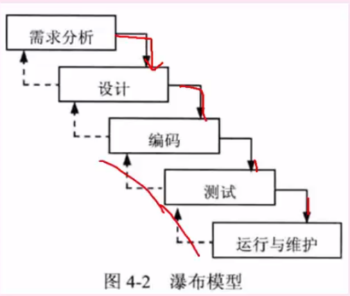
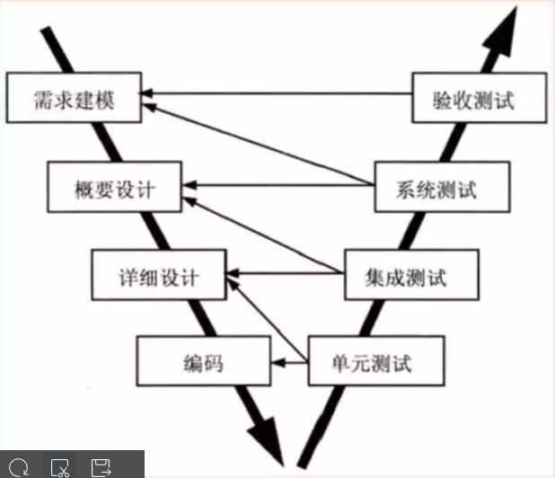
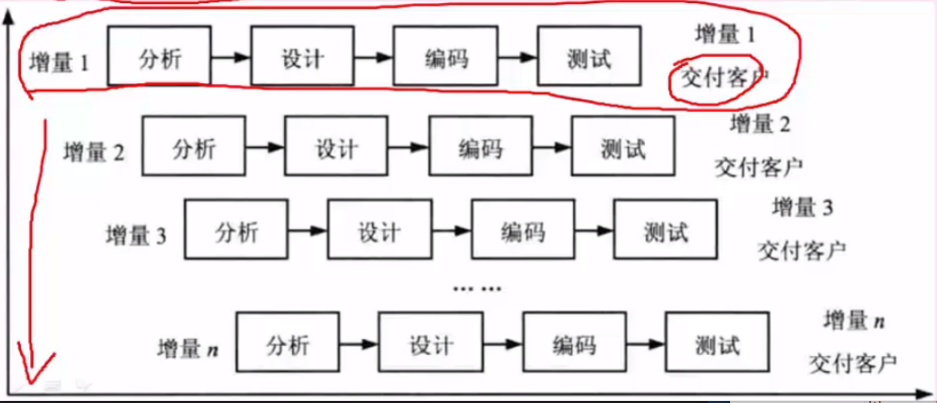
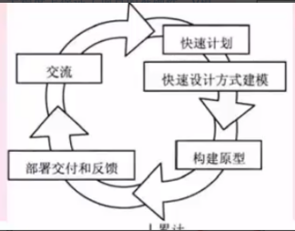
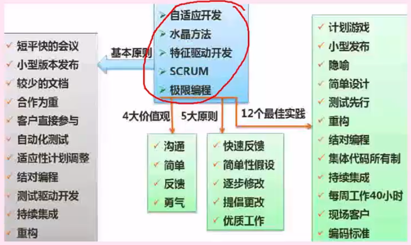
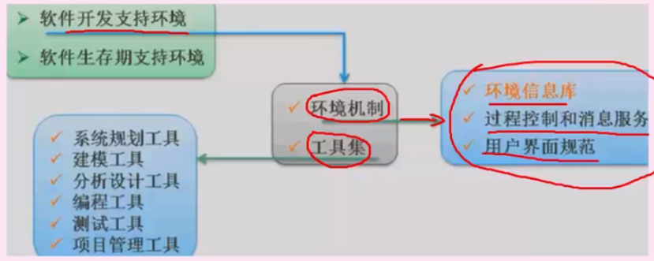
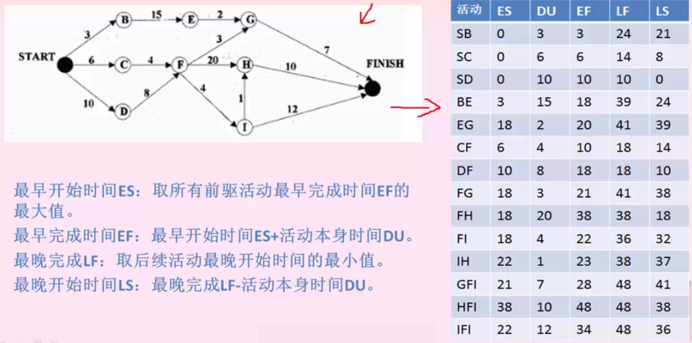
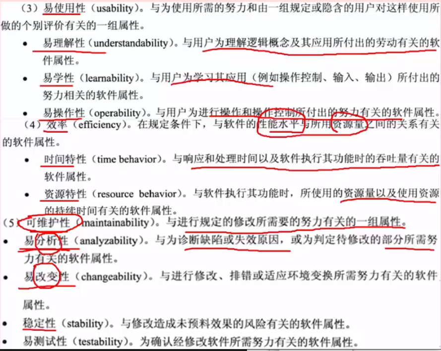
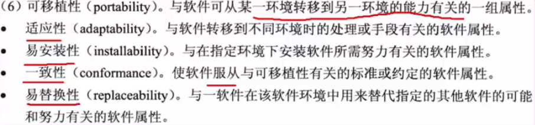

# 第5章软件工程基础知识

## 一.  概述
#### 1.软件工程基本原理:
用分阶段的生命周期计划严格管理/坚持进行阶段评审/实现严格的产品控制/采用现代程序设计技术/结果应能清楚的审查/开发小组的人员应少而精/承认不断改进软件工程实践的必要性.
#### 2.软件工程的基本要素
方法 工具 过程
#### 3.软件生存周期
可行性分析与项目开发计划/需求分析/概要设计(选择系统解决方案,规划子系统)/详细设计(设计子系统内部具体实现)/编码/测试/维护
#### 4.软件过程
+ 4.1能力成熟度CMM模型
对软件组织化阶段的描述，随着软件组织定义、实施、测量、控制和改进软件过程，软件组织的能力经过这些节点逐步提高。
    - 初始级 Initial：杂乱无章、混乱、无明确定义步骤，依靠个人努力和英雄式人物的作用
    - 可重复级 Repeatable：建立例基本的项目管理过程和实践来跟踪项目费用、速度和功能特性。有必要的过程准则来重复以前在同类项目的成功
    - 已定义级 Defined：过程已经文档化、标准化，依靠标准软件过程来开发和维护软件
    - 已管理级 Managed：制定了软件过程和产品质量的详细度量标准，并且被开发组织的成员所熟悉
    - 优化级 Optimized：加强了定量分析，产品反馈、新观念、新技术等是过程能够不断持续改进

+ 4.2能力成熟度CMMI模型
    - 4.2.1 阶段型模型，关注组织的成熟度，五个成熟度模型如下
        - 初始的：过程不可预测且缺乏控制
        - 已管理的：过程为项目服务
        - 已定义的：过程为组织服务
        - 定量管理的：过程已度量和控制
        - 优化的： 集中于过程改进
    - 4.2.2 连续型模型，关注每个过程域的能力，一个组织对不同的过程域可以达到不同的过程域能力等级
        - CL0-未完成的：过程域未执行或未得到CL1中定义的所有目标
        - CL1-未执行的：过程将可表示的输入工作产品转换成可标识的输出工作产品，以实现支持过程域的特定目标
        - CL2-已管理的：以管理的过程的制度化
        - CL3-已定义的：已定义的过程的制度化
        - CL4-定量管理的：可定量管理的过程的制度化
        - CL5-优化的：使用量化手段改变和优化过程域，以满足客户要求的改变和持续改进计划中的过程域
## 二.  软件过程模型
>即软件开发模型,是软件开发全部过程、活动和任务的结构框架
#### 1. 瀑布模型 Waterfall Model
- 1.1 瀑布模型SDLC
    - 结构化方法中的模型，是结构化的开发。
    - 开发流程如同瀑布一般，一步一步的走下去，知道最后完成项目开发
    - **适用于需求明确或者二次开发（需求稳定），当需求不明确时，最终开发的项目会错误，有很大的缺陷。**

- 1.2 瀑布模型V模型
    - 时瀑布模型的一个变体
    - 特点是增加了很多轮测试，并且这些测试贯穿于开发的各个阶段，不想其他模型都是软件开发完再测试。
    - 很大程度上确保了项目的准确性

#### 2. 增量模型 Incremental Model
- 增量模型：首先开发核心模块功能，而后有用户确认，之后再开发核心模块的功能。即每一次开发一部分功能，并与用户需求确认，最终完成项目开发，优先级最高的服务最先交付。
- 特点：不是从系统整体的角度划分整个模块，因此不利于模块划分。**难点在于如何将客户需求划分为多个增量**。与原型不同的是：增量模型的**每一次增量版本都是可独立操作的作品**，而**原型的构造一般是为了演示**。

#### 3. 演化模型 
+ 3.1 原型 Prototype Model
    - 即快速原型开发，与瀑布模型相反，原型针对的就是**需求不明确的情况**
    - 首选快速构造一个功能模型，演示给用户看，病案用户要求进行更改，中间再通过不断的演示和用户沟通，最终设计出项目，就不会出现于客户需求不符合的情况，采用的是`迭代的思想`。

+ 3.2 螺旋模型 Spiral Model
    - 是多种模型的混合，**针对需求不明确的项目**，与原型类似，但是**增加了风险分析**
    - 四步：制定计划->风险分析->实施工程->用户评估

#### 4. 喷泉模型
- 是一种以用户需求为动力，以对象作为驱动的模型，适合于**面向对象的开发方法**。是开发过程具有迭代性和无间隙性。

#### 5. 基于构件的开发模型 Componment-based Development Model
- 利用预先包装的**构件**来构造应用系统。构件可以是组织内部开发的构件，也可以是商品化成产品软件的构件
- 特点是**增强了复用性**，在系统开发的过程中会**构建一个构件库**，供其他系统复用，因此可以提高可靠性，节省时间和成本

#### 6. 形式化开发模型
- 建立在**严格数学基础上的**一种软件开发方法，主要活动是生成计算机软件形式化的数学规格说明

#### 7. 统一过程模型UP
- 初始阶段： 需求和风险评估
- 精华阶段： 需求分析和架构设计
- 构建阶段： 实现过程
- 移交阶段： 测试,增量,交付

#### 8. 敏捷开发
> 针对小型项目，主要是为了给程序员肩负，去掉了一些不必要的会有和文档。开发宣言：个体和交互胜过过程和工具，可以工作的软件胜过面面俱到的文档，客户胜过合同谈判，响应变化胜过遵循计划。

- 8.1 结对编程：一个程序员开发，另一个审查代码，共同负责
- 8.2 自适应开发：强调开发的适应性。
- 8.3 水晶方法：针对每一个项目需要一套不同的策略、约定和方法论
- 8.4 极限编程XP：强调简化、沟通、反馈、勇气。计划赶不上变化，无需做出很多文档，测试优先
- 8.5 并列争球法：一种迭代的增量化过程，每隔一段时间30天一次的迭代称为一个冲刺，按需求优先级，多个组织和小组并行递增实现产品
- 8.6 敏捷统一过程AUP:大型上连续，小型上迭代构件软件系统。

## 三.  软件管理

#### 1. 开发工具
 - 1.1 软件开发工具：软件开发过程的各种活动使用的工具
    - 需求分析工具
    - 设计工具
    - 编码和排错工具
    - 测试工具

- 1.2 软件维护工具：维护过程中的活动的软件，对软件代码何其文档进行各种维护活动
    - 版本控制工具
    - 文档分析工具
    - 开发信息库工具
    - 逆向工程工具
    - 再工程工具

- 1.3 管理和软件支持工具：管理活动和支持活动，确保软件高质量的完成
    - 项目管理工具
    - 配置管理工具
    - 软件评测工具

#### 2. 开发环境
- 由工具集合环境集构成。工具集用于软甲开发的过程、活动、任务。环境集用于提供环境统一的支持。

#### 3. 软件项目管理
+ 3.1 项目估算方法
    - 成本估算方法
    - 自顶向下估算方法：又称类比估算方法，确定一个总金额，再向下分摊到每一个功能点
    - 自底向上复算：从底层功能点估算成本，向上累计
    - 差别估算：与以前项目比较，找出不同点重新估算，相同点直接估算
    - 专家估算：聘请专家一起经验对项目整体费用估算

+ 3.2 项目估算模型
    - 3.2.1 COCOMO 模型
    常见的软件规模估算方法。代码分析作为其中一种度量估计单位，已代码函数福算出每隔程序员工作量，累加得软件成本。
        - 基本COCOMO模型：用一个已估算出来的代码行树为自变量的经验函数计算软件开发工作量。
        - 中间COCOMO模型：在基本模型的基础上再用设计产品硬件、人员、项目等方面的影响因素调整工作量的估算。
        - 详细COCOMO模型：在中间模型的基础上再进一步考虑软件工程中分析、设计、过程等每一步的影响
    - 3.2.2 COCOMO II 模型
    COCOMO 模型的升级。考虑多个成本驱动因子。该方法包括三个阶段型模型。即应用组装模型（软件工程前期阶段使用），早期设计模型（需求已确定并且未建立软件体系结构时使用），体系结构模型（软件构造过程中使用）

    - 3.2.3 Putnam 估算模型
    一种动态多变量模型，假设在软件开发的整个生存周期中工作量有特定的分布。

#### 4. 进程管理
> 基本原则：划分、相互依赖、时间分配、工作量确认、确认职责、明确输出结果、确定里程碑

+ 4.1 Grantt 图
    - 甘特图，又称为横道图。横轴表示时间，纵轴表示活动，以时间顺序表示活动。
    - 能够反映活动间的并行关系，单无法反映活动之间的依赖关系。因此也能以清晰的确认关键任务和关键路径。

+ 4.2 Pert 图
    - 类似于前趋图，是又想吐。反映活动之间的依赖关系，有向边上标注活动的运行时间，但无法反映活动之间的并行关系。
    - 图中的节点：称为事件。`-> 节点`表示上一个节点的任务结束，`节点->`表示改节点开始任务，箭头上的事件表示从该节点开始到结束需要的时间。流入该节点所有任务都结束，该节点才开始运行。
    - 特点：不仅给出了每隔任务的开始时间、结束时间和完成所需要的时间，还给出了任务时间的关系。
    - 关键路径：项目总耗时醉成的一条线路

#### 5. 软件项目的组织
+ 组织结构模式：项目型（项目经理绝对领导）、职能型（部门领导为主）、矩阵型（二者都有，但是权力分割不同）

+ 程序设计小组的组织方式：
    - 主程序员值小组：主程序员全权负责，后院工程师必要时能替代主程序员，适合大规模项目
    - 民主制小组：即无主程序员，决策全是成员参与投票，适合于项目规模小，开发人员少，采用新技术和确定性小的项目
    - 层次式小组：两个层次，一名组长领导若干个高级程序员；每个高级程序要领导若干个程序员。

#### 6. 软件质量管理
+ 6.1 ISO/IEC9126 质量模型

+ 6.2 McCall II 质量模型

+ 6.3 软件质量保证
    - 3个要点：
        - 软件必须满足用户需求，与用户需求不一致的软件无质量可言。
        - 软件影尊徐规定的一些列开发标准，不遵循这些这则的软件质量无法保证
        - 软件海英买组某些隐含的需求：可理解性，可维护性等
    - 7个任务：
        - 应用技术方法
        - 正式的技术评审
        - 测试软件
        - 标准的实施
        - 控制变更
        - 度量
        - 记录保存和报告

#### 7. 容错技术
> 容错就是软件遇到错误的处理能力。主要手段是冗余
- 结构冗余：静态（表决，比较，少数服从多数），动态（多重模块待机备份，故障时切换备份机），混合（两者结合）
- 信息冗余：为检错和纠错再数据中加上一段额外的信息，如校验码原理
- 时间冗余：遇到错误是重复执行，例如回滚，重复执行还有错则转入错误处理逻辑
- 冗余附加技术：石河子时间结构、信息、时间冗余技术所需的资源和技术。包括程序、指令、数据、存放和调动他们的空间和通道等

#### 8. 软件配置管理
+ 8.1 基线：软件过程中生存期各开发阶段末尾的特定点。又称为里程碑，反映阶段性成果。

+ 8.2 软件配置项

+ 8.3 版本控制

#### 9. 软件风险管理
+ 9.1 软件风险特性
    - 不确定性：可能发生也可能不发生
    - 损失：发生会产生恶性后果

+ 9.2 软件风险
    - 9.2.1。 项目风险
        > 项目风险威胁到项目计划。如果发生，有可能推迟项目的进度和增加项目的成本
        - 风险因素：项目预算、进度、人员、资源、利益相关者、需求等方面的潜在问题以及他们对软件项目的影响。
        - 项目复杂度、规模及结构不确定性也属于风险因素

    - 9.2.2 技术风险
        > 技术风险威胁到开发软件质量的交付时间。如果发生，开发工作会变的很困难或不可能
        - 风险因素：设计、实现、接口、验证、维护等方面的潜在问题
        - 此外：规格说明的歧义性、技术的不确定性、技术陈旧以及 前沿技术的风险 等引述

    - 9.2.3 商业风险
        > 威胁到开发软件的生存能力
        - 市场风险：开发了无人需要的优良系统
        - 策略风险：不在符合公司商业策略
        - 销售风险：销售部门不知道如何销售
        - 管理风险：重点转移或人员变动等带来的缺少高级管理层的支持
        - 预算风险：没有得到预算等

+ 9.3 风险管理过程
    - 风险识别：识别项目中的已知和可预测的风险，确定来源、产生条件、描述风险的特征。形成一个风险列表
    - 风险预测：预测风险发生的概率和风险发生的后果
    - 风险评估：定义风险参照水准，将识别出风险评估分类
    - 风险控制：辅助项目组建立处理风险的策略，包括风险避免，风险监控、RMMM计划（风险环节、监控和管理计划）

#### 10. 软件度量
- 软件的两种属性：外部属性指面向管理的属性，可直接测量，一般为性能指标。内部属性指软件产品本身的属性，如可靠性等，只能间接测量
- McCabe 度量法：又称为环路复杂度，假设有向图中有向边为m，节点数为n，则此有向图的环路复杂度为**m-n+2**

> m、n 代表的含义不能混淆。对于程序流程图：每一个条分支边就是一条有向边，每一个语句就是一个顶点
