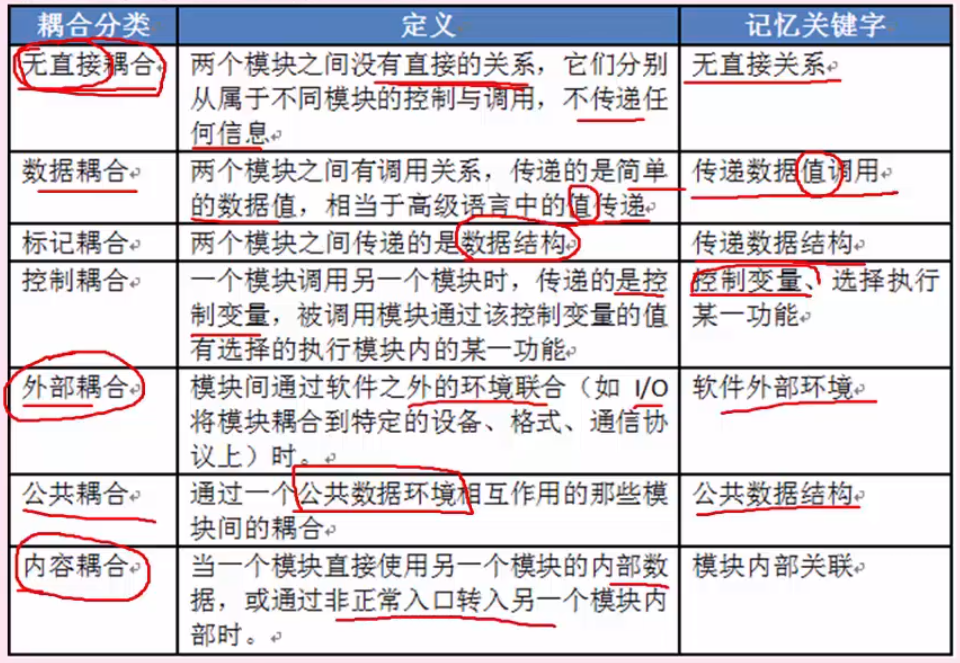

# 第6章 结构化开发方法

## 一 系统分析
- 系统分析是一种问题求解技术，它将一个系统分解成各个组成部分，目的是研究各个部分如何工作、交互，以实现其系统目标。
- 目的和任务：系统分析的主要任务是对线性系统更进一步详细调查，将调查中所得到的文档资料集中，对组织内部整体管理状况和信息处理过程进行分析，为系统开发提供所需的资料，并提交系统方案说明书。
- 系统分析的主要步骤
  - 1） 认识、理解当前的现实环境，获得当前系统的"物理模型"
  - 2） 从当前系统的"物理模型"抽象出当前系统的"逻辑模型"
  - 3)  对当前系统的"逻辑模型"进行分析和优化，建立目标系统的"逻辑模型"
  - 4)  对目标系统的逻辑模型具体化，建立目标系统的物理模型。
- 系统开发的目的是将现有系统的物理模型转换为目标系统的物理模型。

## 二 系统设计

#### 1. 系统设计基本原理

- 抽象（重点说明一个实体的本质方面，忽略非本质方面）
- 模块化 （可组合、分解和更换的单元）
- 信息隐蔽 （将每个程序的成分隐藏或封装在一个单一的设计模块中）
- 模块独立 （每个模块完成一个相对独立的特定子功能，且与其他模块之间的联系简单）

#### 2. 模块之间的联系 **耦合** 和 **内聚**
 
- 2.1 **耦合**：是模块之间的相对独立性的度量

- 2.2 **内聚**：是一个模块内部各个元素彼此结合的紧密程度的度量

### 3. 系统设计过程
- 3.1 系统设计阶段
  > 系统分析阶段，我们弄清楚了“做什么”的问题，并把这些需求通过规格说明书描述了出来，这也是目标系统的逻辑模型。进入设计阶段，要把软件“做什么”的逻辑模型转换成“怎么做”的物理模型

- 3.2 系统设计的主要目的
  >为系统制定蓝图，在各种技术和实施方法中权衡利弊，精心设计，合理地使用各种资源，得出新系统的详细设计方案

- 3.3 系统设计步骤
  > 概要设计 和 详细设计
  - 概要设计基本任务：设计软件系统总体结构、数据结构和数据库设计、编写概要设计文档、评审。
  - 详细设计的基本任务：模块内详细算法设计、模块内数据结构设计、数据库的物理设计、其它设计（代码、输入/输出格式、用户界面）、详细设计说明书、评审。

- 3.4 系统结构设计原则
  - 分解-协助原则
  - 自顶向下原则
  - 信息隐蔽和抽象原则
  - 一致性原则明确性原则
  - 模块间高内聚低耦合
  - 模块的扇入系数和扇出系数合理
  - 模块规模适当

- 3.5 子系统划分的原则
  - 子系统要具有相对独立性
  - 子系统之间数据的依赖性尽量小
  - 子系统划分的结果应使数据冗余较小
  - 子系统的设置应考虑今后管理发展的需要
  - 子系统的划分应便于系统分阶段实现
  - 子系统的划分应考虑到各类资源的充分利用

## 三 WEBAPP分析和设计

#### 1. WEBAPP特性
  - 是基于web的系统和应用，大多数应用采用敏捷开发过程模型进行开发。
  - 网络密集性（服务于不同客户全体的需求）、并发性（大量用户同时访问）、无法预知的负载量（用户数量）、性能（响应时间过长导致用户流失）、可用性、数据驱动（和用户的数据交互）

#### 2. WEBAPP需求模型

  - 2.1 内容模型
    给出由WEBAPP提供的全部系列内容，包括了文字、图形、图像、视频和视频。
  - 2.2 交互模型
    描述了用户与WEBAPP采用了那种交互方式。由一种或多种元素构成，包括用例、顺序图、状态图、用户界面原型等。

  - 2.3 功能模型
    许多WEBAPP提供了大量的计算和操作功能，这些功能与内容直接相关（既能使用又能生成内容，如统计报表）。这些功能常常以用户的交互活动为主要目标。
    功能模型定义了将用户WEBAPP内容并描述其它处理功能的操作，这些功能不依赖于内容却是最终用户所必需的。

  - 2.4 导航模型
    为WEBAPP定义所有导航策略，考虑了每一类用户如何从一个WEBAPP元素（如内容对象）导航到另一个元素

  - 2.5 配置模型
    描述WEBAPP所在环境和基础设施。在必需考虑配置体系结构的情况下，可以使用UML部署图。

#### 3. WEBAPP设计
  - 3.1 架构设计
    使用多层架构来构造，包括用户界面或展示层、基于一组业务规则来知道与用户端浏览器进行信息交互的控制器，以及可以包含WEBAPP的业务规则的内容或模型层，描述将以什么方式来管理用户交互、操作内容处理任务、实现导航及展示内容。

  - 3.2 构件设计
    构件：定义良好的聚合功能，为最终用户处理内容或提供计算或处理数据
    构件内容：关注内容对象，以及包装后展示给最终用户的方式，应该适合创建的WEBAPP特性
    构件功能：将WEBAPP作为一些列构件加以交付，这些构件与信息提携结构并行开发，以确保一致性。

  - 3.3 内容设计
    着重于内容对象的表现和导航的组织，通常采用线性结构、网格机构、层次结构、网络结构四中结构及其组合。

  - 3.4 导航设计
    定义导航路径，使用户可以访问WEBAPP的内容和功能

## 四 软件需求

#### 1. 需求分类
  - 1.1 按需求内容分类
    业务需求：有客户提出的宏观的一个功能需求
    用户需求：设计员去调查需求中设计到的每个用户的具体需求。
    系统需求：经过整合，形成最终的系统需求，包括功能、性能、设计约束三个方面的需求。

  - 1.2 从客户角度分类
    基本需求：需求明确规定的功能
    期望需求：除了基本需求外，客户认为利索应当包含在内的其它功能。
    兴奋需求：未要求的需求和其它功能，会兰妃项目开发时间和成本

  - 1.3 软件需求分类
    功能需求：软件必须完成的基本需求
    性能需求：软件和人与软件交互的静态或动态数值需求，如西戎响应速度、处理速度等。
    设计约束：受其他标准硬件限制等方面的影响
    属性：可用性、安全性、可维护性、可转移性
    外部结构需求：用户接口、硬件接口、软件接口、通信接口

#### 2. 需求工程
  - 2.1 需求获取：收集资料、讨论会JRP、用户访谈、书面调查、现场观摩、参加业务实践、阅读历史文档、抽样调查
  - 2.2 需求分析与协商：分析不同人提出的所有需求之间的关系并判断
  - 2.3 需求规约：即需求定义，目的是为了编写需求文档，在双方间达成一个共识
  - 2.4 需求验证：需求开发节点的复查手段，需求验证通过后，要请用户签字确认，作为验收标准之一，此时，这个需求规格说明书就是需求基线
  - 2.5 需求管理：对需求工程设计的所有过程进行规划和控制

#### 3. 需求管理
  - 3.1 定义需求基线：通过了评审的需求说明书就是需求基线，下次如果需要变更需求，就需要按照流程来一步步进行
  - 3.2 处理需求变更：主要关系需求变更过程中的需求风险管理，带有风险的做法有：无足够用户参与、忽略了用户分类、用户需求的不断增减、模棱两可的需求、不必要的特性、过于精简的srs,不准确的估算。
  - 3.3 需求跟踪：双向跟踪，两个层次，正向跟踪表示用户原始需求是否都实现了，反向跟踪表示软件实现的是否都是用户要求的，不多不少。
  