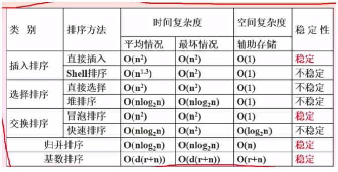
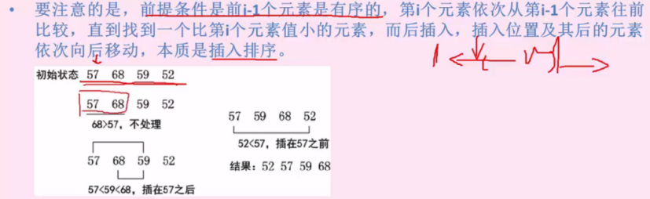
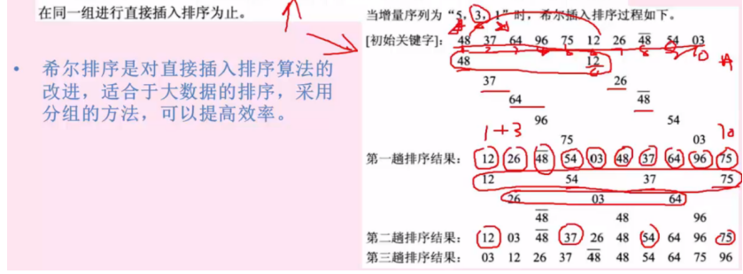
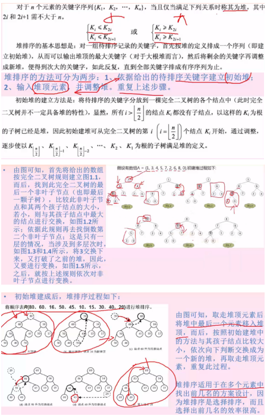
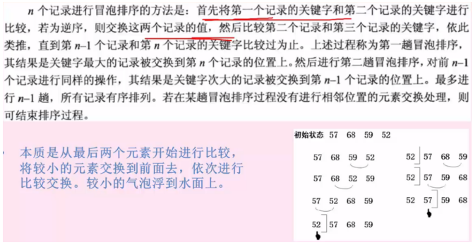
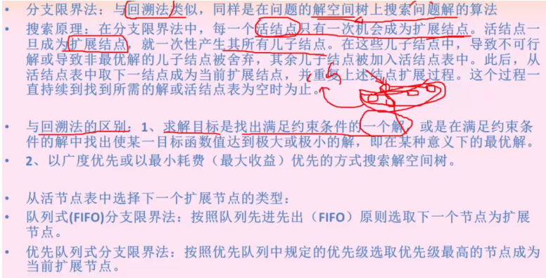
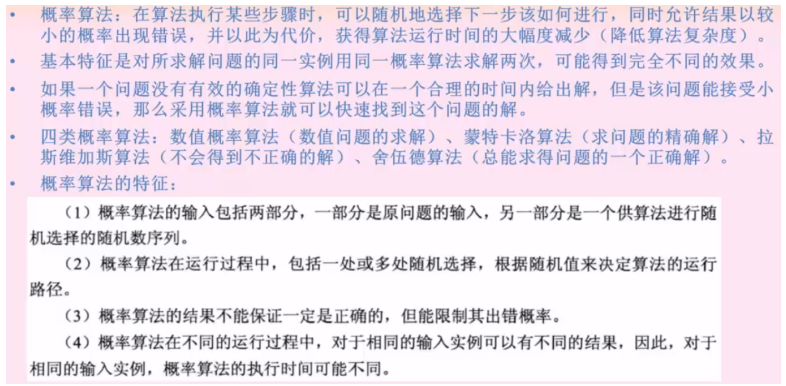
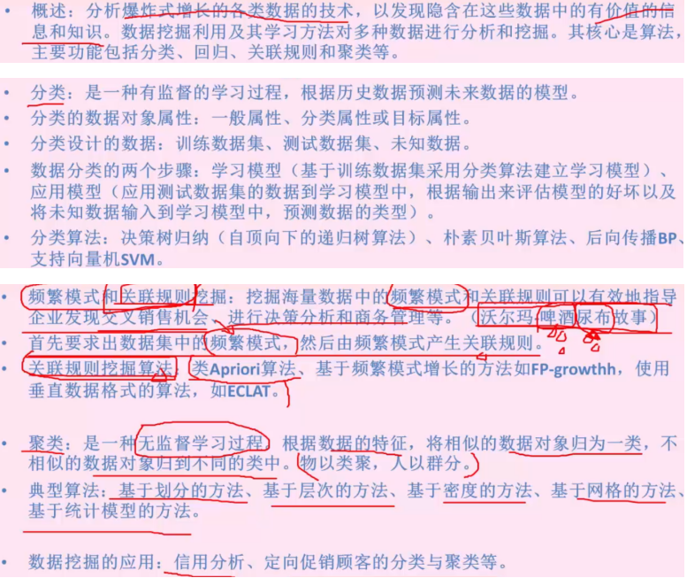
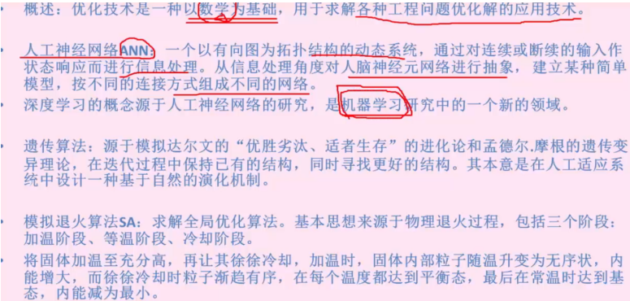

# 第8章算法设计与分析
## 一 算法基础知识

### 1.  算法的特性
  - 算法是对特定问题求解步骤的一种描述,他是指令的有限序列,其中每一条指令表示一个或多个操作.
  - 1.有穷性.一个算法总是在执行有穷步骤之后结束,且每一步都可在有穷时间内完成.
  - 2.确定性.算法中的每一条指令必须有确切的含义,理解时不会产生二义性.并且在任何条件下,算法只有唯一的一条路径,即对于相同的输入只能得出相同的输出.
  - 3.可行性.一个算法是可行的,即算法中描述的操作都可以通过已经实现的基本运算执行有限次来实现.
  - 4.输入.一个算法有零个或多个输入,这些输入取决于某个特定的对象的集合.
  - 5.输出.一个算法有一个或多个输出,这些输出是同输入有着某些特定关系的量.

### 2.  算法分析
  - 时间复杂度

  > 时间复杂度是一个大概的规模表示，一遍以循环次数表示，O（n）说明时间是n的正比，log对数的时间复杂度一般在查找二叉树的算法中出现。渐进符号O表示一个渐进变化程度，实际变化必须小于等于O括号内的渐进变化度。

  - 空间复杂度


## 二 算法分析基础：查找算法

### 1. 顺序查找
  - 顺序查找: 将查找的关键字key从头到尾与表中的元素进行比较,存在则返回成功,否则失败
  - 时间复杂度为O(n),按照顺序依次超找一遍

### 2.  拆半（二分）查找


### 3.  Hash 哈希超找

> 哈希查找冲突处理方法：
1)线性探测，存储到下一个空闲物理空间；
2)伪随机数法，存储到任意空闲存储位置；
3)再次hash散列计算，使用新计算的位置存储


## 三 排序算法
  - 稳定排序与不稳定排序：依据是两个相同的值在排序后的相对位置是否发生了变化。如果发生了变化为不稳定，不发生变化为稳定
  - 内排序和外排序：依据是排序在内存中进行还是在外部进行
  - 排序算法分类：
    - 插入类排序：直接插入排序，shell希尔排序
    - 选择类排序：直接选择排序，堆排序
    - 交换类排序：冒泡排序，快速排序
    - 其它：归并排序，基数排序

  - 排序算法：时间复杂度总结


### 1. 直接插入排序
  - 是一种简单的排序算法。具体做法是在插入第i个元素时，前面的已经排好序，然后将i与前面的元素依次比较，插入到比i大的值前面，i的插入位置后面的元素依次后移


### 2.  SHELL 希尔排序
  - 将待排序的元素分割成若干个子序列，然后分别进行直接插入排序
  ```txt
  分组方法示例：
  待排序元素为n=10个，取一个小于 n 的整数 d （依次减小d，d按照一定的规律增量排列，例如 5,3,1）
  元素按照 5 为间距进行分组，对每个分好组的元素使用直接插入排序
  元素按照 3 为间距再次分组，每个分好组的元素使用直接插入排序
  元素按照 1 为间距再次分组，每个分好组的元素使用直接插入排序
  ```


### 3.  直接选择排序
  - n 个待排序元素：i 与 i后的元素进行比较，从n-i+1个元素中找出最小的，并和第 i 个元素交换，当i等于n时记录有序排列
  - 本质就是选择出最小的元素进行交换，主要是选择过程，交换过程只有一次


### 4.  堆排序


### 5.  冒泡排序


### 6.  快速排序


### 7.  归并排序


### 6.  基数排序


## 四 常用算法策略

### 1.  分治法

1.1 递归概念

- 是指程序（函数）直接调用自己或通过一些列调用语句简介调用自己，是一种描述问题和解决问题的常用方法

- 基本要素：边界条件（确定递归合适终止，即递归出口）；递归模式（即递归体）

1.2 分治法的思想概念

- 对于一个规模为n的问题，若该问题可以容易的解决则直接解决；否则将其分解为k个规模更小的子问题，这些子问题互相独立且与原问题形式相同，递归的解决这些问题，然后将各个子问题的解合并得到原问题的解。

1.3 分治法的步骤

- 分解问题-->求解（递归地求解各子问题，若子问题足够小，则直接求解）-->合并（将各子问题合并成原问题的解）

1.4 凡是涉及到分组解决的都是分治法（二分查找，归并排序等）

### 2.  回溯法

- 有通用的解题方法之称，可以系统地搜索一个问题的所有解或任意解。
- 在包含问题的所有解的空间树中，按照深度优先的策略，从根节点触发搜索解空间树。搜索到任一结点时，总是先判断该节点是否肯定不包含问题的解，如果不包含则跳过对该节点的子树的搜索，逐层向祖先节点回溯；否则进入该子树，继续按深度优先的策略进行搜索。
- 可以理解为深度优先搜索，一直向下探测，当此路不通时，返回上一层探索另外的分支，重复此步骤，这就是回溯，意为先一直探测，当不成功时再返回上一层。
- 一般用于解决迷宫类的问题。

### 3.  动态规划法

- 在求解问题中，对于每一步决策列出各种可能的局部解，再依据某种判定条件，舍弃哪些肯定不能得到最优解的局部解，在每一步都经过筛选，以每一步都是最优解来保证全局是最优解

- 本质也是将复杂的问题划分为一个个子问题，与分治法不同的是每一个子问题间不是相互独立的，并且不全都相同。

- 常用于求解具有某种最优性质的问题。

- 此算法将大量精力放在前期构造表格上面，其会对每一步，列出各种可能的答案，这些答案会存储起来，最终要得出某个结果时，是通过查询这张表来得到的，动态规划法不但每一步最优，全局也最优。

### 4.  贪心法

- 总是做出在当前来说最好的选择，而并不从整体上加以考虑，它2所做的每部选择只是当前步骤的局部最优选择，但从整体来说不一定是最优的选择。由于它不必为了寻找最优解而穷尽所有可能解，因此耗费时间少，一般可以快速得到满意的解，但得不到最优解。

- 局部贪心，只针对当前的步骤取最优，而非整体考虑。

- 判断此类算法，就看算法是否是每一步都取最优，并且整体题意没有透露出最终结果是最优的。

### 5.  分支限界法


### 6.  概率算法


### 7.  近似算法


### 8.  数据挖掘算法


### 9.  智能优化算法

