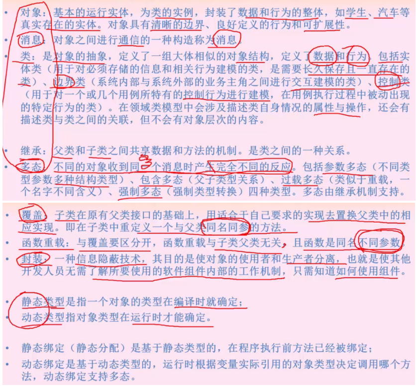
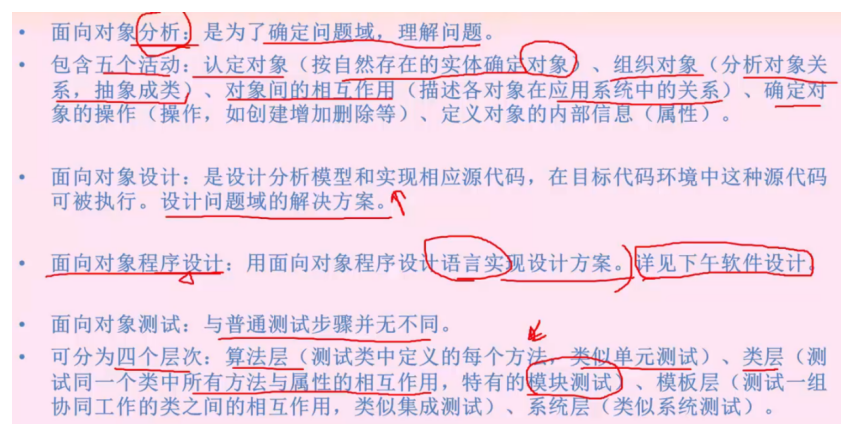
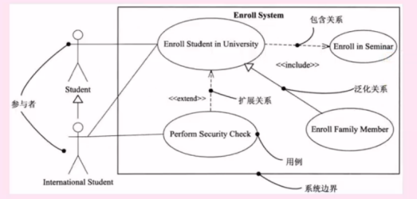
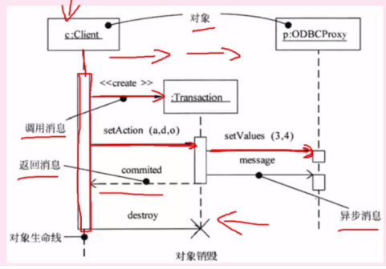
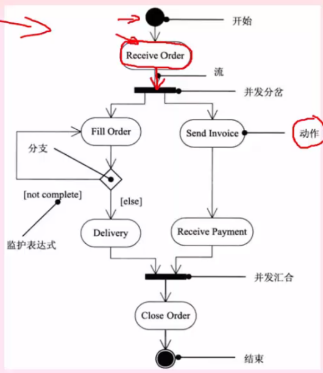

# 第8章面向对象技术(UML建模+设计模式)
## 1. 面向对象
### 1.1 基本概念
- 对象：基本的裕兴实体，为类的实例
- 消息：对象间通信一种构造称为消息
- 类：对象的抽象
- 继承：父类与子类
- 多态：不通的对象收到同一个消息产生不同反应。参数多态，包含多态，过载多态，强制多态
- 覆盖：子类覆盖父类同名同参的方法
- 函数重载：函数同名不同参数
- 封装：
- 静态类型：编译时确定，静态绑定：程序执行前已经被绑定
- 动态类型：运行时确定，动态绑定：运行时实际引用的对象类型决定调用那个方法

### 1.2 分析设计 

## 2. UML 建模
### 2.1 UML建模概念
- UML是统一建模语言，与程序设计语言并无关系
- UML构造块包括：**事物，关系，图**

### 2.2 UML建模中的事物
##### 2.2.1 结构事物
- 模型的静态部分名称

##### 2.2.2 行为事物
- 模型的动态部分：交互，活动，状态机

 
##### 2.2.3 分组事物 和 注释事物
- 分组事物 模型的组织部分，例如：包
- 注释事物 模型的解释部分

### 2.3 UML建模中的关系
- 依赖：一个事物依赖于另一个事物的变化而变化
- 关联：结构关系，描述了一组链，分为组合和聚合（聚集）。是部分和整体的关系。组合关系更强。
- 泛化：一般/特殊 父子关系
- 实现：一个类保证了另一个类执行的契约

### 2.4 UML建模中的图
##### 2.4.1 类图 Class Diagram
- 静态图，系统的静态设计视图。展现一组对象、接口、协作和他们之间的关系。
- UML类图包括：多重度、属性、操作、关系

##### 2.4.2 对象图 Object Diagram
- 静态图。展现某一时刻一组对象及他们之间的关系，为类图的某一快照。
- 在没有类图的状态下，对象图就是静态设计视图

##### 2.4.3 用例图 Use Case Diagram
- 静态图，展现了一组用例、参与者以及它们之间的关系
- 用例图中的参与者是人、硬件、系统可以扮演的角色。用例是参与者完成的一系列操作
- 用例之间的关系是：扩展、包含、泛化

##### 2.4.4 序列图 Sequence Diagram
- 动态图，顺序图。是场景的图形化表示，描述了一时间顺序组织的对象间的交互活动
- 同步消息 左到右 实心箭头，表示阻塞调用，需要等待控制权返回后继续执行
- 异步消息 左到右 空心箭头，表示继续执行，不需要等待控制权返回可以继续执行下一个消息
- 返回消息 右到左 空心箭头

##### 2.4.5 通信图 Communication Diagram
- 动态图，即协作图。是顺序图的另一种表示方法。
- 对象和消息组成的图，不强调时间顺序，只强调事件之间的通信
- 而且也没有固定的画法规则，和顺序图统称为交互图。

##### 2.4.6 状态图 State Diagram
- 动态图，展现了一个状态机，描述单个对象在多个用例中的行为。包括简单状态和组合状态
- 转换可以通过事件触发器触发，事件出发后响应的监护条件会进行检查
- 状态图中转换和状态是两个独立的概念
- 方框：表示状态 箭头：触发事件 实心圆点：起点和终点

##### 2.4.7 活动图 Activity Diagram
- 动态图，是一种特殊的状态图，展现了系统内从一个活动到另一个活动的流程
- 活动的分岔和回合线是一条水平粗线
- 并发分岔、并发回合、监护表达式、分支、流
- 每个分岔的分指数代表了可同时运行的线程数。活动中能够并行执行的是在一个分岔粗线下的分支活动

##### 2.4.8 组件图（构件图）Component Diagram
- 静态图，为系统静态实现视图。展现了一组组件（或构件）之间的组织和依赖

##### 2.4.9 部署图 Deployment Diagram
- 静态图，系统的静态部署图，部署物理模块的节点分布。
- 与组件图相关，通常是一个几点包含一个或多个组件。依赖关系类似于包依赖，因此部署组件之间的依赖是单向的类似于包含关系

## 3. 设计模式

### 1 设计模式概念

### 3.2 设计模式分类
- 创建型设计模式

- 结构型型设计模式

- 行为型设计模式

